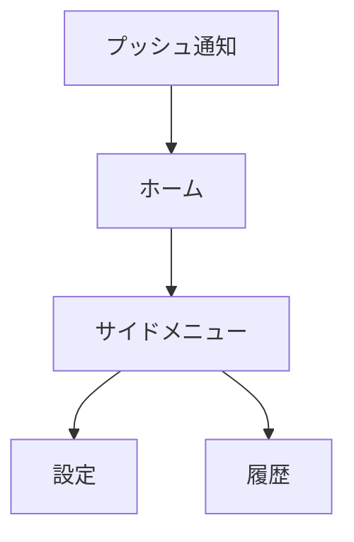

# TOKYO+ 基本設計書

## 1. 文書概要

### 1.1 目的

本書は、[要件定義書](./requirements_definition.md)に基づき、TOKYO+ MVPの外部仕様、システム構成、データ連携、AI判断、画面、運用方針を定義する基本設計書である。

本書の対象は、東京都内の利用者に対して、複数の都市データを統合した「今日のアドバイス」を1件提示し、必要に応じてプッシュ通知する一連の体験である。

### 1.2 対象範囲

| 区分 | 対象 |
|---|---|
| MVP対象 | 今日のアドバイス、AI判断、判断履歴、設定、プッシュ通知、天気を必須としたデータ連携 |
| MVP対象外 | 避難アシスト、自由入力相談、高度な行動履歴パーソナライズ、ヘルス情報、複数都市展開 |
| デモ対象 | 東京駅周辺、事前確認済みの1シナリオ、実データを基本とした正常系・障害系 |

### 1.3 設計上の前提

- クライアントはiOSネイティブアプリ（SwiftUI）とする。
- バックエンドはCloudflare Workersを中心に構成する。
- 天気データは常に判断材料に含める。
- 1回の判断生成で返す推奨行動は1件とする。
- 利用者アカウントは作成せず、端末で生成した匿名IDを利用する。
- 位置情報は判断生成時に一時利用し、クラウドへ永続保存しない。
- AIの出力は自由文ではなく、JSON Schemaに適合する構造化データとして扱う。
- MVPでは、判断の再現性と検証可能性を優先し、対象データ・判断ルール・デモシナリオを限定する。

## 2. 基本方針

### 2.1 システム方針

1. 利用者に情報を列挙せず、最も重要な行動提案を1件に絞る。
2. AIに判断を丸投げせず、データ取得、正規化、発火条件、重複抑制をアプリケーション側で制御する。
3. AI出力には理由、不確実性、参照データを必ず含め、説明可能性を確保する。
4. 利用者向けAPIは生成済み判断を返すことを基本とし、表示時の待ち時間を抑える。
5. データソース障害時は、直近の有効データまたはデモ用モックデータへ切り替え、サービス全体を停止させない。
6. 将来のデータソース追加に備え、データ取得処理と判断処理を疎結合にする。

### 2.2 MVPの品質目標

- ホーム画面を開いてから、今日の行動を短時間で理解できる。
- 通知文だけで推奨行動の概要を理解できる。
- 判断には、利用したデータ種別と理由が紐づいている。
- 正常系では、データ取得からAI判断、履歴保存、通知、画面表示までを一連で実行できる。
- 位置情報拒否、通知拒否、外部API障害を受入シナリオとして再現できる。

## 3. システム構成

### 3.1 論理構成


### 3.2 コンポーネント責務

| コンポーネント | 主な責務 |
|---|---|
| iOSアプリ | 設定入力、権限取得、現在地の一時取得、API呼び出し、判断表示、履歴表示、通知受信 |
| Workers API | 認証相当の匿名ID検証、設定・履歴API、データ取得、発火判定、通知連携 |
| Cron Triggers | データ更新、朝の通知判定、日中の通知判定を定期起動 |
| Queues | データ取得・判断生成・通知送信を非同期化し、処理失敗時の再試行を可能にする |
| D1 | 匿名利用者設定、判断履歴、データ取得状態、通知状態の保存 |
| KV / Cache | 外部APIレスポンス、データソース設定、短期キャッシュの保持 |
| Workers AI | 正規化済みの入力から判断結果を構造化生成 |
| APNs | iOS端末へのプッシュ通知配信 |
| 外部データソース | 天気、東京都オープンデータ、利用可能な交通・混雑・イベント情報の提供 |

### 3.3 処理方式

#### 3.3.1 バッチ処理

1. Cron Triggersが設定された間隔でデータ取得ジョブを起動する。
2. データ取得アダプターが各データソースからデータを取得する。
3. 取得データを共通の正規化形式へ変換し、データソース名、取得時刻、有効期限、出典URLを付与する。
4. 天気を必須として、利用可能な補助データを組み合わせる。
5. 判断ルールで発火対象を絞り込む。
6. 発火対象についてWorkers AIで判断を生成する。
7. JSON Schema検証、禁止値・必須項目検証、文字数検証を行う。
8. 判断履歴を保存し、通知条件を満たす場合のみ通知ジョブを登録する。

#### 3.3.2 アプリ表示

1. アプリ起動時に匿名IDと設定情報を送信する。
2. 位置情報許可済みの場合だけ、現在地を市区町村または定義済みエリアコードに変換して送信する。
3. Workers APIが未読または最新の判断履歴を返す。
4. アプリは判断、推奨行動、理由、不確実性、参照データを表示する。
5. 詳細根拠はアコーディオンで展開する。

## 4. 機能設計

### 4.1 機能一覧

| ID | 機能 | MVP | 概要 |
|---|---|---:|---|
| F-01 | 今日のアドバイス表示 | ○ | 最新の判断を1件表示する |
| F-02 | 判断生成 | ○ | 正規化済みデータとユーザータグから判断を生成する |
| F-03 | 判断履歴 | ○ | 判断、理由、参照データ、通知状態を保存・表示する |
| F-04 | 通知設定 | ○ | 朝の時刻、間隔、上限、頻度、キャラクターを設定する |
| F-05 | プッシュ通知 | ○ | 条件を満たした未通知の判断をAPNsへ送信する |
| F-06 | データ取得・統合 | ○ | 天気を必須としてデータを取得・正規化する |
| F-07 | 権限状態案内 | ○ | 位置情報・通知権限の状態と必要な操作を案内する |
| F-08 | 避難アシスト | × | 将来機能。MVPでは画面・APIともに実装しない |
| F-09 | 自由入力相談 | × | 将来機能。MVPでは入力欄を設けない |

### 4.2 判断発火ルール

判断生成は、次の条件を満たす場合に実行する。

- 天気データが取得できている。
- 対象エリアに重要な変化がある。
- 変化がユーザータグまたは利用エリアと関連する。
- あらかじめ定義した基準値を超えている、または推奨行動が変わる可能性がある。
- 同一のデータ変化に対する未抑制の判断が存在しない。
- 当日の通知上限数に達していない。
- 朝の通知時刻、または設定された通知間隔の条件を満たしている。

発火しない場合は、不要なAI呼び出しと通知を行わず、最新の有効な判断を維持する。

### 4.3 通知制御

| 設定項目 | 設計 |
|---|---|
| 朝の通知時刻 | 利用者設定を保存し、Cron処理で該当時刻の利用者を抽出する |
| 通知間隔 | 1時間、3時間、6時間から選択する |
| 1日の上限 | 利用者設定値を利用し、未設定時はMVPのデフォルト値を適用する |
| 頻度 | うっかりや／わんぱく／まじめを内部の通知間隔・上限設定に変換する |
| キャラクター | 文体だけを変え、判断・理由・注意点の意味は変えない |
| 重複抑制 | 判断ハッシュ、対象日、対象エリアを用いて同一内容の通知を抑止する |
| 3回目以降 | 同一判断が継続した場合、デフォルトで3回目から文言のニュアンスを変更する |

## 5. AI判断設計

### 5.1 AIの責務と非責務

AIの責務は、アプリケーションが選別・正規化したデータをもとに、利用者が取るべき行動、理由、不確実性、参照データを生成することである。

AIに任せない処理は次のとおりとする。

- 外部APIの直接呼び出し
- 基準値の計算や通知上限の判定
- 位置情報の保存
- 通知送信の重複抑制
- JSON Schemaに適合しない出力の採用
- 災害時の安全判断（将来機能を含む）

### 5.2 入力データ

```json
{
  "targetArea": "tokyo_station",
  "generatedAt": "2026-08-05T07:00:00+09:00",
  "userTags": ["通勤", "屋外移動"],
  "weather": {
    "condition": "晴れ",
    "temperatureCelsius": 34,
    "precipitationProbability": 20,
    "wbgt": 29,
    "observedAt": "2026-08-05T06:30:00+09:00",
    "source": "weather-api"
  },
  "supplementalData": [],
  "rulesTriggered": ["HIGH_TEMPERATURE", "COMMUTE_RELEVANCE"]
}
```

### 5.3 出力スキーマ

```json
{
  "title": "今日は暑さに備えよう",
  "recommendedAction": "水筒を持って出かける",
  "reason": "気温が高く、屋外を移動する予定に関係するためです。",
  "uncertainty": "天候は変化する可能性があります。",
  "dataReferences": [
    {
      "type": "weather",
      "label": "天気・気温",
      "observedAt": "2026-08-05T06:30:00+09:00",
      "source": "weather-api"
    }
  ],
  "caution": null,
  "notificationText": "水筒を持って出かけよう。今日は暑くなりそうです。"
}
```

### 5.4 出力検証

- `title`、`recommendedAction`、`reason`、`uncertainty`、`dataReferences`を必須とする。
- 推奨行動は1件のみとする。
- 通知文は短文に制限し、通知で意味が伝わる長さにする。
- 参照データに存在しないデータを根拠として出力した場合は不採用とする。
- エリア、時刻、データ種別が入力と一致しない場合は不採用とする。
- 不採用時は再生成を1回まで行い、それでも失敗した場合はフォールバック文面を利用する。
- キャラクター設定は表現にのみ適用し、数値・結論・注意点は変更しない。

## 6. データ設計

### 6.1 データ保持方針

| データ | 保存先 | 保持方針 |
|---|---|---|
| 匿名ID | D1 | 端末単位で利用。アカウント情報とは紐づけない |
| 通知設定 | D1 | 次回通知判定に必要な範囲で保存 |
| APNsデバイストークン | D1 | 通知送信に必要な範囲で保存。無効化時に削除 |
| ユーザータグ | D1 | 判断生成に必要な設定として保存 |
| 位置情報 | 端末・リクエスト中 | クラウドへ永続保存しない。送信時はエリアコードへ粗粒度化 |
| 正規化済み都市データ | D1またはKV | データ種別と保持期間に応じて保存 |
| 判断履歴 | D1 | 匿名IDに紐づけて保存。次回AI入力には利用しない |
| リアルタイムAPI生データ | 原則非永続 | MVPでは必要時に取得し、将来キャッシュを導入する |

### 6.2 主要テーブル

#### `anonymous_users`

| カラム | 型 | 制約・用途 |
|---|---|---|
| `anonymous_id` | TEXT | PK。端末で生成したUUID |
| `created_at` | INTEGER | 作成日時 |
| `updated_at` | INTEGER | 更新日時 |

#### `user_settings`

| カラム | 型 | 制約・用途 |
|---|---|---|
| `anonymous_id` | TEXT | PK/FK |
| `tags_json` | TEXT | ユーザータグ配列 |
| `morning_time` | TEXT | HH:mm、Asia/Tokyo |
| `notification_interval_hours` | INTEGER | 1、3、6 |
| `daily_limit` | INTEGER | 1日の通知上限 |
| `frequency_type` | TEXT | careless、playful、serious |
| `character_type` | TEXT | default、doctor等 |
| `notification_enabled` | INTEGER | 0/1 |
| `updated_at` | INTEGER | 更新日時 |

#### `judgement_histories`

| カラム | 型 | 制約・用途 |
|---|---|---|
| `id` | TEXT | PK |
| `anonymous_id` | TEXT | FK |
| `target_area` | TEXT | 東京駅周辺等のエリアコード |
| `title` | TEXT | 判断タイトル |
| `recommended_action` | TEXT | 推奨行動1件 |
| `reason` | TEXT | 判断理由 |
| `uncertainty` | TEXT | 不確実性・注意点 |
| `references_json` | TEXT | 参照データ種別・出典・時刻 |
| `trigger_hash` | TEXT | 重複通知抑制用 |
| `generated_at` | INTEGER | AI生成日時 |
| `notified_at` | INTEGER NULL | 通知日時 |
| `status` | TEXT | generated、notified、failed、fallback |

#### `data_snapshots`

| カラム | 型 | 制約・用途 |
|---|---|---|
| `id` | TEXT | PK |
| `source_type` | TEXT | weather、wbgt等 |
| `target_area` | TEXT | 対象エリア |
| `payload_json` | TEXT | 正規化済みデータ |
| `observed_at` | INTEGER | データ観測時刻 |
| `fetched_at` | INTEGER | 取得時刻 |
| `expires_at` | INTEGER | 有効期限 |
| `source_url` | TEXT | 出典 |

### 6.3 データエリア

MVPでは、東京駅周辺をデモ対象エリアとして固定する。位置情報を受け取った場合は、緯度・経度そのものではなく、あらかじめ定義したエリアコードに変換して利用する。将来、エリアを拡張する場合も、エリアコードをキーにデータソース・判断ルールを切り替えられる構造とする。

## 7. API設計

### 7.1 共通仕様

- 通信はHTTPSのみとする。
- `Content-Type: application/json`を使用する。
- リクエストヘッダーに匿名IDを付与する。
- APIキー、AI認証情報、APNs秘密情報はクライアントに返却しない。
- エラー時は`code`、`message`、`retryable`を含む共通形式で返す。

### 7.2 エンドポイント

| Method | Path | 用途 |
|---|---|---|
| GET | `/v1/advice/latest` | 最新の今日のアドバイスを取得 |
| GET | `/v1/judgements` | 判断履歴を取得 |
| GET | `/v1/settings` | 設定を取得 |
| PUT | `/v1/settings` | タグ・通知設定を保存 |
| PUT | `/v1/devices/apns-token` | APNsデバイストークンを登録・更新 |
| POST | `/v1/location/area` | 現在地をエリアコードへ変換して一時利用 |
| GET | `/v1/status` | デモ・外部データ連携の状態確認 |

### 7.3 `GET /v1/advice/latest`

#### 正常レスポンス

```json
{
  "advice": {
    "id": "judgement-uuid",
    "title": "今日は暑さに備えよう",
    "recommendedAction": "水筒を持って出かける",
    "reason": "気温が高く、屋外を移動する予定に関係するためです。",
    "uncertainty": "天候は変化する可能性があります。",
    "dataReferences": [],
    "generatedAt": "2026-08-05T07:00:00+09:00",
    "notified": true
  }
}
```

判断が存在しない場合は、空状態と再取得可能性を返す。位置情報が必要な判断を生成できない場合は、権限案内を返し、位置情報なしの判断を誤って生成しない。

## 8. 画面設計

### 8.1 画面構成



### 8.2 ホーム画面

表示順序は、行動提案を最上位とする。

1. 今日の判断タイトル
2. 推奨行動（最も強調）
3. 理由
4. 不確実性・注意点
5. 参照データのアコーディオン
6. 生成日時・データ更新時刻

データが古い場合は、判断の有効性を過度に保証せず、最終更新時刻と注意文を表示する。判断が存在しない場合は、原因に応じて「データ準備中」「権限が必要」「一時的に利用できない」を表示する。

### 8.3 設定画面

- 位置情報利用の説明とOS設定への導線
- 通知許可の説明とOS設定への導線
- ユーザータグ
- 朝の通知時刻
- 通知間隔（1時間、3時間、6時間）
- 1日の通知上限
- 通知頻度（うっかりや、わんぱく、まじめ）
- 通知キャラクター
- 利用規約・プライバシーポリシーへの導線

設定変更後は、次回の通知判定から反映する。通知権限が拒否されていても、設定値自体は保存できるが、通知は送信しない。

### 8.4 履歴画面

判断日時の降順で一覧表示し、選択した履歴の判断、推奨行動、理由、参照データ、通知状態を表示する。匿名ID以外の個人識別情報は表示しない。

## 9. エラー・フォールバック設計

| 事象 | システム動作 | 利用者への表示 |
|---|---|---|
| 位置情報拒否 | 位置情報を用いる判断を停止し、位置情報を保存しない | 許可が必要な理由と設定導線 |
| 通知拒否 | APNs送信を行わず、履歴は生成済みとして保存 | 通知が無効である旨を設定画面に表示 |
| 天気API障害 | 有効期限内のスナップショットを利用。なければ判断生成を保留 | データ準備中または一時利用不可 |
| 補助データAPI障害 | 当該データを除外し、天気のみで判断可能か再評価 | 参照データが限定される旨を表示 |
| Workers AI障害 | フォールバック文面または事前確認済みデモデータを利用 | データ時刻と注意文を表示 |
| D1障害 | 読み取り可能なキャッシュを利用。書き込みは再試行 | 一時利用不可。デモではモックへ切替 |
| デモ環境の連携失敗 | 事前確認済みデータへ切替 | TOKYO+のミニゲームを表示 |

フォールバックで表示する内容は、実際の最新データに基づく判断と誤認されないよう、取得時刻またはデモデータであることを表示する。

## 10. セキュリティ・プライバシー設計

- 個人アカウント、氏名、メールアドレス、パスワードはMVPで扱わない。
- 匿名IDは推測困難なUUIDとし、サーバー側で形式を検証する。
- 位置情報は端末側でエリアコードに変換し、緯度・経度をD1に保存しない。
- 位置情報の送信は、利用者が許可した場合かつ判断生成に必要な場合に限定する。
- APIキー、Workers AI認証情報、APNs秘密鍵はCloudflare側のSecretとして管理する。
- ログに位置情報、APNsトークン、ユーザータグの不要な詳細を出力しない。
- 外部データの利用規約、ライセンス、出典表示要否をデータソースごとに管理する。
- AI出力は入力参照データとの整合性を検証してから保存・通知する。

## 11. 運用・監視設計

### 11.1 監視対象

- データソース別の取得成功率、取得時間、最終取得時刻
- AI呼び出し成功率、JSON Schema検証失敗率、再生成率
- 判断生成数、通知送信数、通知失敗数
- APIのエラー率、レイテンシ、Cloudflareリソース使用量
- フォールバック発生数

### 11.2 ログ方針

ログには、匿名IDをそのまま出力せず、必要に応じて短縮ハッシュを利用する。ログには処理ID、データ種別、対象エリア、処理結果、エラーコード、時刻を記録し、位置情報の生値やAI入力全文は記録しない。

### 11.3 デモ運用

- デモ開始前に外部API、AI、APNs、TestFlightの接続を確認する。
- 東京駅周辺のシナリオと期待する判断内容を事前検証する。
- 外部API障害時に切り替えるモックデータを用意する。
- 判断生成、履歴保存、通知、画面表示を事前に通しで確認する。
- 障害時は、データ/API障害、アプリ障害、デモ判断の担当をチーム内で決定して対応する。

## 12. 受入確認項目

| ID | シナリオ | 確認内容 |
|---|---|---|
| AT-01 | 正常系 | 実データ取得、AI判断、履歴保存、プッシュ通知、アプリ表示が連続して成功する |
| AT-02 | 位置情報拒否 | 位置情報を必要とする判断を停止し、許可案内を表示する |
| AT-03 | 通知拒否 | 通知を送信せず、アプリ内では判断を確認できる |
| AT-04 | 外部API障害 | モックまたは事前確認済みデータへ切り替わり、必要に応じてミニゲームを表示する |
| AT-05 | 重複通知 | 同一内容の通知が設定間隔・上限を超えて送信されない |
| AT-06 | 説明可能性 | 判断、推奨行動、理由、不確実性、参照データが表示される |
| AT-07 | 1件制約 | 1回の生成・表示で推奨行動が1件に絞られる |

## 13. 未確定事項・詳細設計への引継ぎ

以下は基本設計で方針を定めたが、実装前に詳細設計で具体値を確定する。

- 採用する天気API、東京都オープンデータ、補助データの正式なデータセット
- データソースごとの利用規約、ライセンス、出典表示文
- Cronの実行間隔、タイムゾーン、キューの再試行回数
- 1日の通知上限のデフォルト値
- 東京駅周辺のエリア境界とエリアコード定義
- D1のインデックス、データ保持期間、削除処理
- APNsの認証方式とデバイストークン無効化処理
- Workers AIの採用モデル、プロンプトバージョン、トークン上限
- 具体的なUIレイアウト、色、フォント、アクセシビリティ対応
- ミニゲームの内容とデモ切替方法

## 14. 設計判断記録

| ID | 判断 | 理由 |
|---|---|---|
| ADR-001 | 生成済み判断を基本表示する | 利用者の待ち時間を抑え、MVPの一連の体験を安定させるため |
| ADR-002 | AI入力を正規化済みデータに限定する | 出典・時刻・形式を管理し、AIの根拠を検証可能にするため |
| ADR-003 | 判断を1回1件にする | 情報羅列ではなく、行動提案というコンセプトを明確にするため |
| ADR-004 | 位置情報をエリアコード化して一時利用する | プライバシーリスクを抑えつつ周辺データを利用するため |
| ADR-005 | 避難アシストをMVPから分離する | 災害時の安全性・責任・データ要件が通常のアドバイスより重いため |

