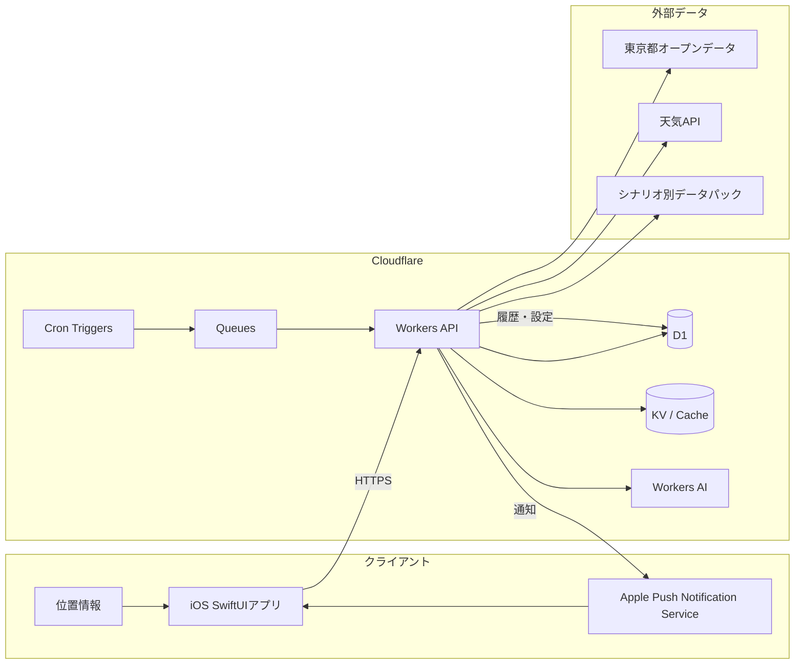
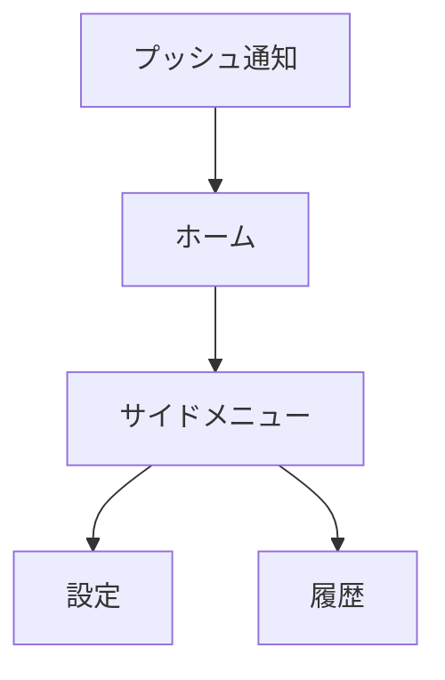

# TOKYO+ 基本設計書

## 1. 文書概要

### 1.1 目的

本書は、[要件定義書](./requirements_definition.md)に基づき、TOKYO+ MVPの外部仕様、システム構成、データ連携、AI判断、画面、運用方針を定義する基本設計書である。

本書の対象は、東京都内の利用者に対して、複数の都市データを統合した「今日のアドバイス」を1件提示し、必要に応じてプッシュ通知する一連の体験である。

### 1.2 対象範囲

| 区分 | 対象 |
|---|---|
| MVP対象 | 今日のアドバイス、AI判断、判断履歴、設定、プッシュ通知、天気を必須としたデータ連携 |
| MVP対象外 | 避難アシスト、自由入力相談、高度な行動履歴パーソナライズ、ヘルス情報、複数都市展開 |
| デモ対象 | 東京駅周辺を主エリアとし、東京都全域データを組み合わせた複数の事前確認済みシナリオ、実データを基本とした正常系・障害系 |

### 1.3 設計上の前提

- クライアントはiOSネイティブアプリ（SwiftUI）とする。
- バックエンドはCloudflare Workersを中心に構成する。
- 天気データは常に判断材料に含める。
- 1回の判断生成で返す推奨行動は1件とする。
- 利用者アカウントは作成せず、端末で生成した匿名IDを利用する。
- 位置情報は判断生成時に一時利用し、クラウドへ永続保存しない。
- AIの出力は自由文ではなく、JSON Schemaに適合する構造化データとして扱う。
- MVPでは、出力形式と安全上の制約は共通化するが、利用データやシナリオの数は狭く限定しない。実取得・鮮度・出典・判断ルールを確認できたシナリオパックを追加する。

## 2. 基本方針

### 2.1 システム方針

1. 利用者に情報を列挙せず、最も重要な行動提案を1件に絞る。
2. AIに判断を丸投げせず、データ取得、正規化、発火条件、重複抑制をアプリケーション側で制御する。
3. AI出力には理由、不確実性、参照データを必ず含め、説明可能性を確保する。
4. 利用者向けAPIは生成済み判断を返すことを基本とし、表示時の待ち時間を抑える。
5. 必須データソース障害時は正確な判断を生成・表示せず、本来のアドバイス表示領域にTOKYO+のミニゲームを表示する。補助データソース障害時は、その補助データを根拠とする判断だけを停止し、残りの採用済みデータで成立する判断は継続する。
6. データソースごとの取得アダプターとシナリオパックを分離し、MVPでも複数シナリオを追加できるようにする。

### 2.2 MVPの品質目標

- ホーム画面を開いてから、今日の行動を短時間で理解できる。
- 通知文だけで推奨行動の概要を理解できる。
- 判断には、利用したデータ種別と理由が紐づいている。
- 正常系では、データ取得からAI判断、履歴保存、通知、画面表示までを一連で実行できる。
- 位置情報拒否、通知拒否、外部API障害を受入シナリオとして再現できる。

## 3. システム構成

### 3.1 論理構成



### 3.2 コンポーネント責務

| コンポーネント | 主な責務 |
|---|---|
| iOSアプリ | 設定入力、権限取得、現在地の一時取得、API呼び出し、判断表示、履歴表示、通知受信 |
| Workers API | 認証相当の匿名ID検証、設定・履歴API、データ取得、発火判定、通知連携 |
| Cron Triggers | データ更新、朝の通知判定、日中の通知判定を定期起動 |
| Queues | データ取得・判断生成・通知送信を非同期化し、処理失敗時の再試行を可能にする |
| D1 | 匿名利用者設定、判断履歴、データ取得状態、通知状態の保存 |
| KV / Cache | 外部APIレスポンス、データソース設定、短期キャッシュの保持 |
| Workers AI | 正規化済みの入力から判断結果を構造化生成 |
| APNs | iOS端末へのプッシュ通知配信 |
| 外部データソース | 天気、東京都オープンデータ、WBGT、FREE Wi-Fi、工事、地震等のシナリオ別データの提供 |

### 3.3 処理方式

#### 3.3.1 バッチ処理

1. Cron Triggersが設定された間隔でデータ取得ジョブを起動する。
2. データ取得アダプターが各データソースからデータを取得する。
3. 取得データを共通の正規化形式へ変換し、データソース名、取得時刻、有効期限、出典URLを付与する。
4. 天気を必須として、発火したシナリオパックに必要な採用済みデータを組み合わせる。未検証の候補データは判断入力に含めない。
5. 判断ルールで発火対象を絞り込む。
6. 発火対象についてWorkers AIで判断を生成する。
7. JSON Schema検証、禁止値・必須項目検証、文字数検証を行う。
8. 判断履歴を保存し、通知条件を満たす場合のみ通知ジョブを登録する。

#### 3.3.2 アプリ表示

1. アプリ起動時に匿名IDと設定情報を送信する。
2. 位置情報許可済みの場合だけ、現在地を市区町村または定義済みエリアコードに変換して送信する。
3. Workers APIが未読または最新の判断履歴を返す。
4. アプリは判断、推奨行動、理由、不確実性、参照データを表示する。
5. 詳細根拠はアコーディオンで展開する。

## 4. 機能設計

### 4.1 機能一覧

| ID | 機能 | MVP | 概要 |
|---|---|---:|---|
| F-01 | 今日のアドバイス表示 | ○ | 最新の判断を1件表示する |
| F-02 | 判断生成 | ○ | 正規化済みデータとユーザータグから判断を生成する |
| F-03 | 判断履歴 | ○ | 判断、理由、参照データ、通知状態を保存・表示する |
| F-04 | 通知設定 | ○ | 朝の時刻、間隔、上限、頻度、キャラクターを設定する |
| F-05 | プッシュ通知 | ○ | 条件を満たした未通知の判断をAPNsへ送信する |
| F-06 | データ取得・統合 | ○ | 天気を必須としてデータを取得・正規化する |
| F-07 | 権限状態案内 | ○ | 位置情報・通知権限の状態と必要な操作を案内する |
| F-08 | 避難アシスト | × | 将来機能。MVPでは避難先選定・避難ルート計算は実装しない。地震情報に対する公式情報確認の注意喚起は「今日のアドバイス」のシナリオとして扱う |
| F-09 | 自由入力相談 | × | 将来機能。MVPでは入力欄を設けない |

### 4.2 判断発火ルール

判断生成は、次の条件を満たす場合に実行する。

- 天気データが取得できている。
- 補助データを使う場合は、データソースごとの鮮度、対象エリア、ライセンス確認が完了している。
- 対象エリアに重要な変化がある。
- 変化がユーザータグまたは利用エリアと関連する。
- あらかじめ定義した基準値を超えている、または推奨行動が変わる可能性がある。
- 同一のデータ変化に対する未抑制の判断が存在しない。
- 当日の通知上限数に達していない。
- 朝の通知時刻、または設定された通知間隔の条件を満たしている。

発火しない場合は、不要なAI呼び出しと通知を行わず、最新の有効な判断を維持する。

### 4.3 通知制御

| 設定項目 | 設計 |
|---|---|
| 朝の通知時刻 | 利用者設定を保存し、Cron処理で該当時刻の利用者を抽出する |
| 通知間隔 | 1時間、3時間、6時間から選択する |
| 1日の上限 | 利用者設定値を利用し、未設定時はMVPのデフォルト値を適用する |
| 頻度 | うっかりや／わんぱく／まじめを内部の通知間隔・上限設定に変換する |
| キャラクター | 文体だけを変え、判断・理由・注意点の意味は変えない |
| 重複抑制 | 判断ハッシュ、対象日、対象エリアを用いて同一内容の通知を抑止する |
| 初回〜2回目 | デフォルトの文言ニュアンスで通知する |
| 3回目 | デフォルトから文言ニュアンスを変更できる旨を通知で案内する |
| 4回目以降 | 利用者が変更を選択した場合は、選択した文言ニュアンスで通知する |

## 5. AI判断設計

### 5.1 AIの責務と非責務

AIの責務は、アプリケーションが選別・正規化したデータをもとに、利用者が取るべき行動、理由、不確実性、参照データを生成することである。

AIに任せない処理は次のとおりとする。

- 外部APIの直接呼び出し
- 基準値の計算や通知上限の判定
- 位置情報の保存
- 通知送信の重複抑制
- JSON Schemaに適合しない出力の採用
- 災害時の安全判断（将来機能を含む）

### 5.2 入力データ

```json
{
  "targetArea": "tokyo_station",
  "generatedAt": "2026-08-08T11:00:00+09:00",
  "userTags": ["通勤", "屋外移動"],
  "weather": {
    "condition": "晴れ 時々 くもり",
    "temperatureCelsius": 35,
    "precipitationProbability": 20,
    "wbgt": 32,
    "observedAt": "2026-08-08T11:00:00+09:00",
    "source": "jma_forecast"
  },
  "supplementalData": [],
  "rulesTriggered": ["HIGH_TEMPERATURE", "COMMUTE_RELEVANCE"]
}
```

### 5.3 出力スキーマ

```json
{
  "title": "今日は暑さに備えよう",
  "recommendedAction": "水筒を持って出かける",
  "reason": "気温が高く、屋外を移動する予定に関係するためです。",
  "uncertainty": "天候は変化する可能性があります。",
  "dataReferences": [
    {
      "type": "weather",
      "label": "天気・気温",
      "observedAt": "2026-08-08T11:00:00+09:00",
      "source": "jma_forecast"
    }
  ],
  "caution": null,
  "notificationText": "水筒を持って出かけよう。今日は暑くなりそうです。"
}
```

### 5.4 出力検証

- `title`、`recommendedAction`、`reason`、`uncertainty`、`dataReferences`を必須とする。
- 推奨行動は1件のみとする。
- 通知文は短文に制限し、通知で意味が伝わる長さにする。
- 参照データに存在しないデータを根拠として出力した場合は不採用とする。
- エリア、時刻、データ種別が入力と一致しない場合は不採用とする。
- 不採用時は再生成を1回まで行い、それでも失敗した場合はフォールバック文面を利用する。
- キャラクター設定は表現にのみ適用し、数値・結論・注意点は変更しない。

## 6. データ設計

### 6.1 データ保持方針

| データ | 保存先 | 保持方針 |
|---|---|---|
| 匿名ID | D1 | 端末単位で利用。アカウント情報とは紐づけない |
| 通知設定 | D1 | 次回通知判定に必要な範囲で保存 |
| APNsデバイストークン | D1 | 通知送信に必要な範囲で保存。無効化時に削除 |
| ユーザータグ | D1 | 判断生成に必要な設定として保存 |
| 位置情報 | 端末・リクエスト中 | クラウドへ永続保存しない。送信時はエリアコードへ粗粒度化 |
| 正規化済み都市データ | D1またはKV | データ種別と保持期間に応じて保存 |
| 判断履歴 | D1 | 匿名IDに紐づけて保存。次回AI入力には利用しない |
| リアルタイムAPI生データ | 原則非永続 | MVPでは必要時に取得し、将来キャッシュを導入する |

### 6.2 主要テーブル

#### `anonymous_users`

| カラム | 型 | 制約・用途 |
|---|---|---|
| `anonymous_id` | TEXT | PK。端末で生成したUUID |
| `created_at` | INTEGER | 作成日時 |
| `updated_at` | INTEGER | 更新日時 |

#### `user_settings`

| カラム | 型 | 制約・用途 |
|---|---|---|
| `anonymous_id` | TEXT | PK/FK |
| `tags_json` | TEXT | ユーザータグ配列 |
| `morning_time` | TEXT | HH:mm、Asia/Tokyo |
| `notification_interval_hours` | INTEGER | 1、3、6 |
| `daily_limit` | INTEGER | 1日の通知上限 |
| `frequency_type` | TEXT | careless、playful、serious |
| `character_type` | TEXT | default、doctor等 |
| `notification_enabled` | INTEGER | 0/1 |
| `updated_at` | INTEGER | 更新日時 |

#### `judgement_histories`

| カラム | 型 | 制約・用途 |
|---|---|---|
| `id` | TEXT | PK |
| `anonymous_id` | TEXT | FK |
| `target_area` | TEXT | 東京駅周辺等のエリアコード |
| `title` | TEXT | 判断タイトル |
| `recommended_action` | TEXT | 推奨行動1件 |
| `reason` | TEXT | 判断理由 |
| `uncertainty` | TEXT | 不確実性・注意点 |
| `references_json` | TEXT | 参照データ種別・出典・時刻 |
| `trigger_hash` | TEXT | 重複通知抑制用 |
| `generated_at` | INTEGER | AI生成日時 |
| `notified_at` | INTEGER NULL | 通知日時 |
| `status` | TEXT | generated、notified、failed、fallback |

#### `data_snapshots`

| カラム | 型 | 制約・用途 |
|---|---|---|
| `id` | TEXT | PK |
| `source_type` | TEXT | weather、wbgt等 |
| `target_area` | TEXT | 対象エリア |
| `payload_json` | TEXT | 正規化済みデータ |
| `observed_at` | INTEGER | データ観測時刻 |
| `fetched_at` | INTEGER | 取得時刻 |
| `expires_at` | INTEGER | 有効期限 |
| `source_url` | TEXT | 出典 |

### 6.3 データエリア

MVPの主エリアは、東京駅を中心とする周辺デモエリア（東京駅および隣接する千代田区・中央区の一部）とする。東京都全域の位置情報付きデータは、主エリア内の候補抽出にも利用する。位置情報を受け取った場合は、緯度・経度そのものではなく、`tokyo_station`等のエリアコードに変換して利用する。将来、エリアを拡張する場合も、エリアコードをキーにデータソース・判断ルールを切り替えられる構造とする。

### 6.4 MVP確定データソースとシナリオパック（2026-08-08検証）

今回の検証では、取得できたことだけでなく、対象エリア、取得時刻、データの意味、利用条件、シナリオでの使い方を確認した。MVPの実行時データソースは3件に限定せず、共通データとシナリオ別データパックを組み合わせる。URL台帳、シナリオ対応、鮮度ルールは本節および6.5〜6.9で管理する。

| 状態 | データソース | 取得先 | 利用する項目 | 利用条件・制約 |
|---|---|---|---|---|
| 採用 | 気象庁 府県天気予報JSON | [東京地方の予報JSON](https://www.jma.go.jp/bosai/forecast/data/forecast/130000.json) | 東京地方の天気、降水確率、東京の気温 | APIキー不要。`reportDatetime`を取得時刻として記録し、24時間を超えたデータは判断に使わない。気象庁の出典を表示する。 |
| 採用 | 環境省 熱中症予防情報サイト WBGT予測API | [getForecastData](https://www.wbgt.env.go.jp/api/v1/getForecastData) | WBGT予測値、発表時刻、予測対象時刻、品質情報 | APIキー不要。東京の情報提供地点番号`44132`を利用する。値は10で割ってWBGTに変換する。東京駅そのものの観測値ではないため、代表地点であることを表示する。環境省の出典を表示する。 |
| 採用（補助） | 中央区 公衆トイレ一覧 | [東京都カタログ](https://catalog.data.metro.tokyo.lg.jp/dataset/t131024d0000000036) / [公衆トイレCSV](https://www.city.chuo.lg.jp/documents/984/kousyuutoilet.csv) | 施設名、所在地、緯度、経度、バリアフリー等の設備項目 | CC BY。CSVはCP932として取得・UTF-8へ正規化する。施設位置の案内だけに利用し、営業中・休憩可能・給水可能であることは推定しない。取得時に施設情報の鮮度を確認し、古い場合はアドバイスの根拠から外す。 |
| 採用（補助） | 東京都 公衆無線LANアクセスポイント一覧 | [東京都カタログ](https://catalog.data.metro.tokyo.lg.jp/dataset/t000029d0000000025) / [FREE Wi-Fi CSV](https://www.opendata.metro.tokyo.lg.jp/suisyoudataset/130001_public_wireless_lan_20240901.csv) | 名称、住所、緯度、経度、SSID、提供エリア、URL、最終確認日 | CC BY。CSVはCP932として取得・UTF-8へ正規化する。東京駅周辺の候補を案内するが、現在の稼働状況、接続品質、認証成功は保証しない。 |
| 採用（工事） | 23区内 都道の路上工事情報 | [東京都カタログ](https://catalog.data.metro.tokyo.lg.jp/dataset/t000014d2000000028) / [現行CSV](https://www.opendata.metro.tokyo.lg.jp/kensetsu/202606_todo_roadconstructioninformation.csv) | 道路名、起点・終点、車線制限、工事期間、予定時間、工事内容 | CC BY。対象月が当月に含まれる工事を候補にする。月単位の予定情報であり、リアルタイムの通行止めや混雑を表すものではないため、経路回避の「確認」を提案する。 |
| 採用（注意喚起） | 気象庁 地震情報一覧JSON | [地震情報一覧JSON](https://www.jma.go.jp/bosai/quake/data/list.json) | 発表時刻、震央、マグニチュード、最大震度、地域別震度 | APIキー不要。東京または周辺地域で基準以上の震度が発表された場合に、公式情報の確認を促す。避難先や安全をAIが独自に断定する用途には使わない。 |

東京都オープンデータカタログのAPIカタログは、データセット探索と仕様確認に利用する。カタログAPI自体を「今日のアドバイス」の判断データとは扱わず、実際のCSVまたは個別APIの取得先を`source_url`に保存する。

各シナリオパックは、入力タグ、対象エリア、発火条件、利用データ、推奨行動の種類を定義する。MVPでは次のパックを実装対象とする。

| ID | シナリオパック | 主な利用者タグ | 主なデータ | 発火例 | 推奨行動の例 | 状態 |
|---|---|---|---|---|---|---|
| S-01 | 暑さ・屋外移動 | 通勤、屋外移動、子育て | 気象庁、WBGT、公衆トイレ | 最高気温またはWBGTが基準超過 | 水分・休憩地点を事前に確認する | 実データ検証済み |
| S-02 | 雨・天候変化 | 通勤、屋外移動 | 気象庁、工事情報 | 降水確率上昇、雨・雷雨の記述、工事区間との重複 | 傘を準備し、工事区間を避ける経路を確認する | 実データ検証済み |
| S-03 | 外出先の通信確保 | 外出、テレワーク、旅行 | 東京都 FREE Wi-Fi、気象庁 | 利用エリア周辺にFREE Wi-Fi候補が存在 | 経路上のFREE Wi-Fi候補を1か所確認する | 実データ検証済み |
| S-04 | 工事・経路確認 | 通勤、徒歩、自転車 | 路上工事情報、位置情報 | 当月の工事区間が利用エリアまたは移動目的に関連 | 出発前に迂回経路を確認する | 実データ検証済み |
| S-05 | 地震・公式情報確認 | 全般 | 気象庁地震情報 | 対象地域で基準以上の震度情報が発表 | 気象庁・自治体の最新情報を確認する | API取得検証済み、発火条件は要受入確認 |

WBGT予測の検証リクエストは、`GET https://www.wbgt.env.go.jp/api/v1/getForecastData?wbgt_nos=44132&location_type=1&date_search_type=1&range_date_from=20260808000000&range_date_to=20260808235959` とした。

### 6.5 実取得による「今日のアドバイス」検証

2026-08-08（日本時間）に、共通ソース3件を実取得してMVPの入力形式に正規化した。さらに、FREE Wi-Fi、路上工事、地震情報の各データも個別に実取得し、シナリオパックの発火条件と出力例を確認した。

| ソース | 実取得結果 |
|---|---|
| 気象庁 | `reportDatetime=2026-08-08T11:00:00+09:00`。東京地方は「晴れ 時々 くもり」、東京の最高気温予報は35℃、12時・18時の降水確率は20%。 |
| 環境省WBGT | `status=success`。地点`44132`の12時予測は`320`であり、WBGTは32.0。発表時刻は11時のレスポンスを採用。 |
| 中央区公衆トイレ一覧 | CSVを取得し、東京駅周辺の立ち寄り候補例として「新京橋際」（緯度35.674449、経度139.771571）を確認。施設の運用状態はデータから判定しない。 |

上記を入力として生成した検証結果は次のとおりである。

```json
{
  "title": "今日は休憩地点を先に決めよう",
  "recommendedAction": "外出前に、東京駅周辺の経路上で立ち寄れる公衆トイレを1か所確認しておく。",
  "reason": "東京の最高気温は35℃、WBGTは正午に32.0の予測です。暑さの中で屋外移動が見込まれるため、先に立ち寄り候補を決めておきましょう。",
  "uncertainty": "東京地方は午後に局地的な雨や雷雨の可能性があります。公衆トイレの開放状況、休憩や給水の可否は一覧から判定できないため、出発前に現地表示も確認してください。",
  "dataReferences": [
    {
      "type": "weather",
      "label": "気象庁 東京地方予報",
      "observedAt": "2026-08-08T11:00:00+09:00",
      "source": "https://www.jma.go.jp/bosai/forecast/data/forecast/130000.json"
    },
    {
      "type": "wbgt",
      "label": "環境省 WBGT予測（地点44132）",
      "observedAt": "2026-08-08T11:00:00+09:00",
      "source": "https://www.wbgt.env.go.jp/api/v1/getForecastData"
    },
    {
      "type": "public_facility",
      "label": "中央区 公衆トイレ一覧",
      "observedAt": "2026-08-08T11:00:00+09:00",
      "source": "https://www.city.chuo.lg.jp/documents/984/kousyuutoilet.csv"
    }
  ],
  "caution": "WBGTは東京駅の実測値ではなく、環境省の情報提供地点44132を代表値として利用しています。"
}
```

この結果により、天気・暑さ指数・位置情報付き施設一覧を統合した基本的な今日のアドバイスは実現可能と判断する。ただし、施設一覧は静的な位置情報であり、混雑、営業状態、交通状況を表すものではない。

同じ共通出力形式で、追加のシナリオも実データから成立することを確認した。

#### 外出先の通信確保シナリオ

東京都FREE Wi-Fi CSVから、東京駅周辺の「公衆電話（千代田区丸の内1-6）」等のアクセスポイントを抽出できた。`userTags=["外出","テレワーク"]`、`targetArea="tokyo_station"`の場合、次のような判断を生成できる。

実取得で確認した代表レコードは次のとおりである。

- 名称: 公衆電話（千代田区丸の内1-6）
- 緯度・経度: 35.683649, 139.765431
- SSID: `FREE_Wi-Fi_and_TOKYO`
- データ上の最終確認日: 2024-09-01

このデータは東京都全域を対象とするため、区民向けに限定されない外出・テレワーク・旅行シナリオに利用できる。ただし、データ更新日が古いため、アドバイスは「設置場所の候補を確認する」に限定する。

```json
{
  "title": "外出先の通信手段を先に確認しよう",
  "recommendedAction": "東京駅周辺の経路上で使えそうなFREE Wi-Fiを1か所確認しておく。",
  "reason": "東京都の公衆無線LAN一覧に、丸の内周辺のFREE Wi-Fiアクセスポイントが登録されています。",
  "uncertainty": "データの最終確認日は2024-09-01です。現在の稼働状況や接続品質は現地で確認してください。"
}
```

#### 工事・経路確認シナリオ

東京都の現行路上工事CSVから、東京駅八重洲口周辺に関係する外堀通り・八重洲地下街の工事レコードを抽出できた。工事期間は2026年8月を含み、車線制限や夜間工事の予定時間も取得できる。`userTags=["通勤"]`の場合、次のような判断を生成できる。

```json
{
  "title": "八重洲の工事区間を避けて移動しよう",
  "recommendedAction": "出発前に、外堀通りの八重洲地下街周辺を避ける経路を確認する。",
  "reason": "東京駅周辺の道路工事情報に、当月の車線制限を伴う工事が登録されています。",
  "uncertainty": "このデータは月単位の予定情報であり、現在の通行止めや混雑を保証しません。現地の案内も確認してください。"
}
```

#### 地震情報シナリオ

気象庁の地震情報一覧JSONは、2026-08-08 16:55発生・16:58発表の千葉県東方沖、最大震度1の情報を実取得できた。現在の値は発火基準未満のためアドバイスは生成しなかったが、震度基準と対象地域を満たした場合に「公式情報を確認する」注意喚起へ分岐できることを確認した。このパックでは避難先・安全をAIが独自に決めず、気象庁・自治体の公式情報への導線だけを提供する。

### 6.6 調査した候補の扱い

| 状態 | 候補 | 判断理由 |
|---|---|---|
| 保留 | 中央区イベント一覧 | CSVは取得できたが、実データの最終レコードが2023年で、2026-08-08のイベントを確認できなかった。今日のアドバイスには使わない。 |
| 不採用（MVP） | 港区イベント情報 | 港区民以外にも使える情報ではあるが、区単位データであり、23区横断の網羅性を担保できない。東京都イベント一覧もデータ本体が2019年更新のため、今日のイベントには使わない。 |
| 保留 | 千代田区 公共施設・公衆トイレ一覧 | 東京駅エリアとの適合性は高いが、今回の実行ではレスポンス本文の取得・項目確認まで完了していない。中央区データで実装検証後に追加する。 |
| 保留 | 東京都の交通オープンデータ／GTFS-RT | 公共交通オープンデータセンターの利用登録等が必要なため、無料・キー不要のMVPソースには含めない。 |
| 不採用 | Open-Meteo | プロトタイプ用途の無料枠はあるが、非商用条件がある。プロダクトの利用形態が確定するまで採用しない。 |
| 採用（限定用途） | 気象庁の地震情報一覧JSON | 最新情報を実取得できた。MVPでは避難先を判断せず、一定震度以上のときに公式情報確認を促す注意喚起に限定する。 |
| 保留 | 気象庁の防災気象情報警報JSON | エンドポイントは存在するが、今回の取得結果の`reportDatetime`が現在日より古かった。実装時は鮮度検証を必須とし、現状は判断根拠に使わない。 |
| 将来 | 避難所・避難場所、災害時の避難行動 | 安全性・鮮度・責任範囲が通常のアドバイスと異なるため、避難アシストの詳細設計で別途検証する。 |

### 6.7 MVP URL台帳（シナリオ・API・東京都オープンデータ）

6.4〜6.6で採否と実取得結果を確認したデータソースを、実装時に参照する識別子・URL単位で台帳化する。判断データとして取得するURLと、データセットの探索・仕様確認に使うカタログURLを区別する。

#### 6.7.1 外部API

| ID | API | URL | APIキー | 主な項目 | 状態・検証結果 |
|---|---|---|---|---|---|
| API-01 | 気象庁 府県天気予報JSON | [東京地方の予報JSON](https://www.jma.go.jp/bosai/forecast/data/forecast/130000.json) | 不要 | 東京地方の天気、降水確率、東京の気温、発表時刻 | 採用。2026-08-08 11:00発表のデータを取得。 |
| API-02 | 環境省 WBGT予測API | [getForecastData](https://www.wbgt.env.go.jp/api/v1/getForecastData) | 不要 | WBGT予測値、発表時刻、予測時刻、品質情報 | 採用。地点`44132`の2026-08-08 12:00予測`320`（WBGT 32.0）を取得。 |
| API-03 | 気象庁 地震情報一覧JSON | [地震情報一覧JSON](https://www.jma.go.jp/bosai/quake/data/list.json) | 不要 | 発表時刻、震央、マグニチュード、最大震度、地域別震度 | 採用（注意喚起限定）。2026-08-08 16:58発表の地震情報を取得。 |

API-02のMVP検証リクエストは次のとおりとする。

```text
GET https://www.wbgt.env.go.jp/api/v1/getForecastData?wbgt_nos=44132&location_type=1&date_search_type=1&range_date_from=20260808000000&range_date_to=20260808235959
```

WBGT地点`44132`は東京駅の実測地点ではないため、画面上では「東京周辺の代表地点」と表示する。WBGTのAPI値は10で割って利用する。

#### 6.7.2 東京都オープンデータ

| ID | データセット | カタログURL | 実データURL | 形式・ライセンス | 主な項目 | 状態・検証結果 |
|---|---|---|---|---|---|---|
| OD-01 | 中央区 公衆トイレ一覧 | [東京都カタログ](https://catalog.data.metro.tokyo.lg.jp/dataset/t131024d0000000036) | [公衆トイレCSV](https://www.city.chuo.lg.jp/documents/984/kousyuutoilet.csv) | CSV、CC BY、CP932 | 名称、所在地、緯度、経度、バリアフリー設備 | 採用（補助）。「新京橋際」等のレコードを取得。UTF-8へ正規化する。 |
| OD-02 | 東京都 公衆無線LANアクセスポイント一覧 | [東京都カタログ](https://catalog.data.metro.tokyo.lg.jp/dataset/t000029d0000000025) | [FREE Wi-Fi CSV](https://www.opendata.metro.tokyo.lg.jp/suisyoudataset/130001_public_wireless_lan_20240901.csv) | CSV、CC BY、CP932 | 名称、住所、緯度、経度、SSID、提供エリア、URL、最終確認日 | 採用（補助）。東京駅周辺の丸の内のアクセスポイントを取得。データ上の最終確認日は2024-09-01。 |
| OD-03 | 23区内 都道の路上工事情報 | [東京都カタログ](https://catalog.data.metro.tokyo.lg.jp/dataset/t000014d2000000028) | [現行CSV](https://www.opendata.metro.tokyo.lg.jp/kensetsu/202606_todo_roadconstructioninformation.csv) | CSV、CC BY | 道路名、起点・終点、車線制限、工事期間、予定時間、工事内容 | 採用。八重洲・外堀通り周辺の2026年8月を含む工事レコードを取得。 |

#### 6.7.3 データカタログ・仕様確認用API

以下は判断データそのものではなく、データセットの探索・仕様確認に使用する。カタログAPIのレスポンスを「今日のアドバイス」の根拠データとして保存・提示してはならず、実際のCSVまたは個別APIの取得先を`source_url`に保存する。

| 用途 | URL |
|---|---|
| 東京都オープンデータポータル | [portal.data.metro.tokyo.lg.jp](https://portal.data.metro.tokyo.lg.jp/) |
| 東京都オープンデータカタログAPI利用ガイド | [API利用ガイド](https://spec.api.metro.tokyo.lg.jp/spec/usage) |
| CKANパッケージ情報取得APIの例 | [OD-02のpackage_show](https://catalog.data.metro.tokyo.lg.jp/api/3/action/package_show?id=t000029d0000000025) |

### 6.8 共通取得・正規化・鮮度仕様

すべてのデータソースはAIへ直接渡さず、次の共通項目を持つ正規化データへ変換する。

| 項目 | 内容 |
|---|---|
| `sourceType` | `weather`、`wbgt`、`public_wifi`、`roadwork`、`earthquake`、`public_facility`等 |
| `sourceUrl` | 実際に取得したAPIまたはファイルのURL |
| `fetchedAt` | TOKYO+が取得した時刻 |
| `observedAt` | データ提供元の発表時刻、予測対象時刻、工事期間等 |
| `targetArea` | `tokyo_station`等のエリアコード |
| `freshnessStatus` | `fresh`、`stale`、`unknown` |
| `license` | CC BY、提供元利用条件等 |
| `attribution` | 画面または詳細根拠に表示する出典名 |
| `payload` | シナリオパックが利用する正規化済み項目 |

鮮度と利用範囲は次のルールで判定する。

- 気象庁天気予報: `reportDatetime`から24時間を超えた場合は判断に使わない。
- WBGT: `reference_time`と`forecast_time`を記録し、対象日・対象時刻が一致する値だけを使う。
- FREE Wi-Fi: 位置情報から一定距離内のアクセスポイントを候補にする。最終確認日が古い場合は設置場所の案内に限定し、利用可能とは断定しない。
- 路上工事: 対象月が当月に含まれるレコードを候補にする。ただし、リアルタイム交通情報とは区別する。
- 地震情報: `rdt`または発表時刻を記録し、一定時間を超えた古い情報を新規発火に使わない。

### 6.9 シナリオパック実装完了条件

各シナリオパックは、次を満たした時点でMVP実装済みとする。

1. 実データまたはAPIレスポンスを取得できる。
2. 対象エリアと利用者タグに応じた発火条件を再現できる。
3. 正規化データ、出典、取得時刻、鮮度を履歴に保存できる。
4. 推奨行動を1件、理由、不確実性、参照データ付きで生成できる。
5. データ欠損、鮮度不明、外部API障害時のフォールバックを確認できる。
6. データ提供元のライセンス・出典表示を画面または詳細根拠に反映できる。

## 7. API設計

### 7.1 共通仕様

- 通信はHTTPSのみとする。
- `Content-Type: application/json`を使用する。
- リクエストヘッダーに匿名IDを付与する。
- APIキー、AI認証情報、APNs秘密情報はクライアントに返却しない。
- エラー時は`code`、`message`、`retryable`を含む共通形式で返す。

### 7.2 エンドポイント

| Method | Path | 用途 |
|---|---|---|
| GET | `/v1/advice/latest` | 最新の今日のアドバイスを取得 |
| GET | `/v1/judgements` | 判断履歴を取得 |
| GET | `/v1/settings` | 設定を取得 |
| PUT | `/v1/settings` | タグ・通知設定を保存 |
| PUT | `/v1/devices/apns-token` | APNsデバイストークンを登録・更新 |
| POST | `/v1/location/area` | 現在地をエリアコードへ変換して一時利用 |
| GET | `/v1/status` | デモ・外部データ連携の状態確認 |

### 7.3 `GET /v1/advice/latest`

#### 正常レスポンス

```json
{
  "advice": {
    "id": "judgement-uuid",
    "title": "今日は暑さに備えよう",
    "recommendedAction": "水筒を持って出かける",
    "reason": "気温が高く、屋外を移動する予定に関係するためです。",
    "uncertainty": "天候は変化する可能性があります。",
    "dataReferences": [],
    "generatedAt": "2026-08-05T07:00:00+09:00",
    "notified": true
  }
}
```

判断が存在しない場合は、空状態と再取得可能性を返す。位置情報が必要な判断を生成できない場合は、権限案内を返し、位置情報なしの判断を誤って生成しない。

## 8. 画面設計

### 8.1 画面構成



### 8.2 ホーム画面

表示順序は、行動提案を最上位とする。

1. 今日の判断タイトル
2. 推奨行動（最も強調）
3. 理由
4. 不確実性・注意点
5. 参照データのアコーディオン
6. 生成日時・データ更新時刻

データが古い場合は、判断の有効性を過度に保証せず、最終更新時刻と注意文を表示する。判断が存在しない場合は、原因に応じて「データ準備中」「権限が必要」「一時的に利用できない」を表示する。

### 8.3 設定画面

- 位置情報利用の説明とOS設定への導線
- 通知許可の説明とOS設定への導線
- ユーザータグ
- 朝の通知時刻
- 通知間隔（1時間、3時間、6時間）
- 1日の通知上限
- 通知頻度（うっかりや、わんぱく、まじめ）
- 通知キャラクター
- 利用規約・プライバシーポリシーへの導線

設定変更後は、次回の通知判定から反映する。通知権限が拒否されていても、設定値自体は保存できるが、通知は送信しない。

### 8.4 履歴画面

判断日時の降順で一覧表示し、選択した履歴の判断、推奨行動、理由、参照データ、通知状態を表示する。匿名ID以外の個人識別情報は表示しない。

## 9. エラー・フォールバック設計

| 事象 | システム動作 | 利用者への表示 |
|---|---|---|
| 位置情報拒否 | 位置情報を用いる判断を停止し、位置情報を保存しない | 許可が必要な理由と設定導線 |
| 通知拒否 | APNs送信を行わず、履歴は生成済みとして保存 | 通知が無効である旨を設定画面に表示 |
| 天気API障害 | 正確な判断を生成・表示しない | 本来のアドバイス表示領域にミニゲームを表示 |
| 補助データAPI障害 | その補助データを根拠とする判断を停止し、残りの採用済みデータだけで成立する判断があれば生成する | 補助データを使わない判断を表示。成立しなければ本来のアドバイス表示領域にミニゲームを表示 |
| 補助データの鮮度・対象エリア検証失敗 | 当該データを入力から除外する | データを使わない判断を表示。成立しなければミニゲームを表示 |
| Workers AI障害 | AI判断を生成・表示しない | 本来のアドバイス表示領域にミニゲームを表示 |
| D1障害 | 読み取り可能なキャッシュを利用。書き込みは再試行 | 一時利用不可。デモではモックへ切替 |
| デモ環境の連携失敗 | 事前確認済みデータへ切替 | TOKYO+のミニゲームを表示 |

必須データソース障害時は、実際の最新データに基づく判断と誤認されないよう、アドバイスを表示せずミニゲームを表示する。補助データソース障害時は、補助データを使わない判断が成立する場合に限り、その範囲でアドバイスを表示する。ミニゲームから障害またはデータ除外が発生していることを確認できるようにする。

## 10. セキュリティ・プライバシー設計

- 個人アカウント、氏名、メールアドレス、パスワードはMVPで扱わない。
- 匿名IDは推測困難なUUIDとし、サーバー側で形式を検証する。
- 位置情報は端末側でエリアコードに変換し、緯度・経度をD1に保存しない。
- 位置情報の送信は、利用者が許可した場合かつ判断生成に必要な場合に限定する。
- APIキー、Workers AI認証情報、APNs秘密鍵はCloudflare側のSecretとして管理する。
- ログに位置情報、APNsトークン、ユーザータグの不要な詳細を出力しない。
- 外部データの利用規約、ライセンス、出典表示要否をデータソースごとに管理する。
- AI出力は入力参照データとの整合性を検証してから保存・通知する。

## 11. 運用・監視設計

### 11.1 監視対象

- データソース別の取得成功率、取得時間、最終取得時刻
- AI呼び出し成功率、JSON Schema検証失敗率、再生成率
- 判断生成数、通知送信数、通知失敗数
- APIのエラー率、レイテンシ、Cloudflareリソース使用量
- フォールバック発生数

### 11.2 ログ方針

ログには、匿名IDをそのまま出力せず、必要に応じて短縮ハッシュを利用する。ログには処理ID、データ種別、対象エリア、処理結果、エラーコード、時刻を記録し、位置情報の生値やAI入力全文は記録しない。

### 11.3 デモ運用

- デモ開始前に外部API、AI、APNs、TestFlightの接続を確認する。
- 東京駅周辺を主エリアとする複数シナリオと、東京都全域データを利用する外出支援シナリオの期待する判断内容を事前検証する。
- 外部API障害時に切り替えるモックデータを用意する。
- 判断生成、履歴保存、通知、画面表示を事前に通しで確認する。
- 障害時は、データ/API障害、アプリ障害、デモ判断の担当をチーム内で決定して対応する。

## 12. 受入確認項目

| ID | シナリオ | 確認内容 |
|---|---|---|
| AT-01 | 正常系 | 実データ取得、AI判断、履歴保存、プッシュ通知、アプリ表示が連続して成功する |
| AT-02 | 位置情報拒否 | 位置情報を必要とする判断を停止し、許可案内を表示する |
| AT-03 | 通知拒否 | 通知を送信せず、アプリ内では判断を確認できる |
| AT-04 | 外部API障害 | 正確なアドバイスを表示せず、本来のアドバイス表示領域にミニゲームを表示する |
| AT-05 | 重複通知 | 同一内容の通知が設定間隔・上限を超えて送信されない |
| AT-06 | 説明可能性 | 判断、推奨行動、理由、不確実性、参照データが表示される |
| AT-07 | 1件制約 | 1回の生成・表示で推奨行動が1件に絞られる |

## 13. 未確定事項・詳細設計への引継ぎ

以下は基本設計で方針を定めたが、実装前に詳細設計で具体値を確定する。

- MVPで採用するデータソースとシナリオパックは6.4で確定した。詳細設計では、各アダプターの実装、タイムアウト、キャッシュ、有効期限、出典表示を確定する。
- 千代田区の公共施設・公衆トイレデータを追加する場合は、実データ取得、東京駅エリアのレコード抽出、施設情報の鮮度確認を完了させる。
- 交通・混雑データは、当日性・利用登録・ライセンスを再確認したうえで、追加シナリオパックとして組み込む。
- データソースごとの利用規約、ライセンス、出典表示文
- Cronの実行間隔、タイムゾーン、キューの再試行回数
- 1日の通知上限のデフォルト値
- 東京駅周辺のエリア境界とエリアコード定義
- D1のインデックス、データ保持期間、削除処理
- APNsの認証方式とデバイストークン無効化処理
- Workers AIの採用モデル、プロンプトバージョン、トークン上限
- 具体的なUIレイアウト、色、フォント、アクセシビリティ対応
- ミニゲームの内容とデモ切替方法

## 14. 設計判断記録

| ID | 判断 | 理由 |
|---|---|---|
| ADR-001 | 生成済み判断を基本表示する | 利用者の待ち時間を抑え、MVPの一連の体験を安定させるため |
| ADR-002 | AI入力を正規化済みデータに限定する | 出典・時刻・形式を管理し、AIの根拠を検証可能にするため |
| ADR-003 | 判断を1回1件にする | 情報羅列ではなく、行動提案というコンセプトを明確にするため |
| ADR-004 | 位置情報をエリアコード化して一時利用する | プライバシーリスクを抑えつつ周辺データを利用するため |
| ADR-005 | 避難アシストをMVPから分離する | 災害時の安全性・責任・データ要件が通常のアドバイスより重いため |
| ADR-006 | MVPの実行時データを共通ソースと複数のシナリオパックで構成する | 1種類のアドバイスに閉じず、暑さ、天候、外出先通信、工事、地震情報確認の複数シナリオを実データで検証できたため |
| ADR-007 | 未検証の候補データはAI入力に含めない | データの鮮度、対象エリア、利用条件を確認できない状態で判断根拠にすると、説明可能性と安全性を損なうため |
