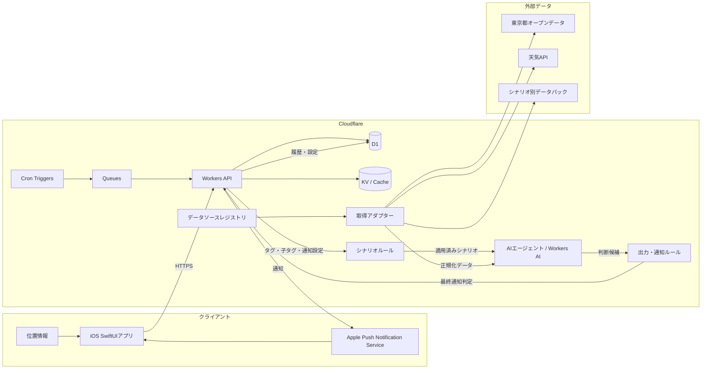
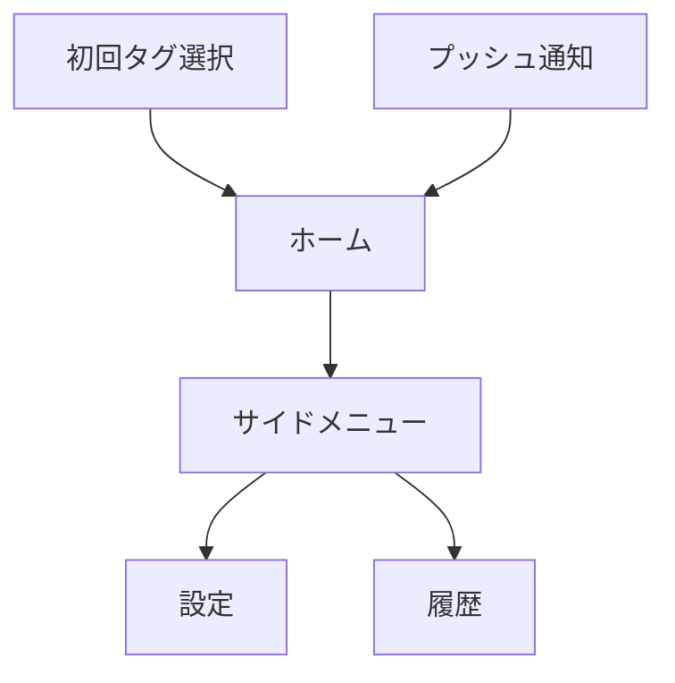

# TOKYO+ 基本設計書

## 1. 文書概要

### 1.1 目的

本書は、[要件定義書](./requirements_definition.md)に基づき、TOKYO+ MVPの外部仕様、システム構成、データ連携、AI判断、画面、運用方針を定義する基本設計書である。

本書の対象は、TOKYO+の「今日のアドバイス」機能である。TOKYO+は、複数の都市データを統合し、シナリオに応じたアドバイス結果を生成する。1回の生成では、行動を含む判断を常に1件返し、必要に応じてプッシュ通知する。

### 1.2 対象範囲

| 区分 | 対象 |
|---|---|
| MVP対象 | 今日のアドバイス、AI判断、判断履歴、設定、プッシュ通知、天気を必須としたデータ連携 |
| MVP対象外 | 避難アシスト、自由入力相談、高度な行動履歴パーソナライズ、ヘルス情報、複数都市展開 |
| デモ対象 | 東京駅周辺を主エリアとし、東京都全域データを組み合わせた複数の事前確認済みシナリオ、実データを基本とした正常系・障害系 |

### 1.3 設計上の前提

- クライアントはiOSネイティブアプリ（SwiftUI）とする。
- バックエンドはCloudflare Workersを中心に構成する。
- すべての日時は`Asia/Tokyo`で扱い、API・保存値はISO 8601のオフセット付き日時またはUTCエポック秒で統一する。
- 天気データは常に判断材料に含める。
- TOKYO+は、1回のアドバイス生成で行動を含む判断を常に1件返す。
- 利用者アカウントは作成せず、端末で生成した匿名IDを利用する。
- 位置情報は判断生成時に一時利用し、クラウドへ永続保存しない。
- AIの出力は自由文ではなく、JSON Schemaに適合する構造化データとして扱う。
- MVPでは、出力形式と安全上の制約は共通化するが、利用データやシナリオの数は狭く限定しない。実取得・鮮度・出典・判断ルールを確認できたシナリオパックを追加する。
- 「東京都オープンデータ／APIカタログにあるものだけを使用する」という制約は、公共交通運行情報のデータソースに適用する。気象庁・環境省などの公式公開APIは、公共交通以外のシナリオで別枠の採用基準を満たした場合に限り使用する。
- MVPの実行対象シナリオはS-01、S-02、S-04、S-05とする。S-03は東京都カタログ掲載範囲のうち、認証情報と実レスポンスの検証が完了した事業者・路線だけを有効化する。未検証の場合も他シナリオの実行を停止しない。

### 1.4 ドメイン用語

本書では、利用者が見る用語と、システム内部で処理する用語を分けて扱う。`シナリオパック`、`発火条件`、`データスコープ`は内部用語であり、アプリ画面や通知には表示しない。

| 用語 | 内部識別子の例 | 説明・使い分け |
|---|---|---|
| TOKYO+ | `tokyoPlus` | 都市データを統合し、利用者に行動を含む判断を返すサービス全体。TOKYO+は常に判断を1件返す。 |
| 今日のアドバイス | `todayAdvice` | TOKYO+が提供する機能およびアドバイスの出力ジャンル。複数のシナリオを共通の形式で扱い、1回の実行で1件のアドバイス結果を返す。今日のアドバイス自体は機能名・ジャンル名であり、返却値そのものではない。 |
| アドバイス結果 | `adviceResult` | 今日のアドバイス機能が返す値。タイトル、判断、理由、不確実性、参照データで構成する。 |
| 判断 | `judgement` | AIがデータとルールから導き、利用者へ送信する最終的なメッセージ。利用者に何が起きていて、何をすべきかを含む。別の行動項目には分けず、1つの値として扱う。 |
| シナリオ | `scenario` | 今日のアドバイスに含まれる判断テーマ。「暑さ・屋外移動」「雨・天候変化」など、どの状況でどのデータと条件を使うかを定義する。 |
| シナリオパック | `scenarioPack` | 1つのシナリオを実行するための設定単位。対象タグ、必要データ、対象範囲、発火条件、鮮度条件、判断メッセージの制約、出典・利用条件をひとまとめにしたもの。データそのものでも、生成された判断そのものでもない。 |
| 発火条件 | `triggerCondition` | シナリオを適用できるかを判定する条件。基準値、データの重要な変化、タグとの関連性、対象範囲、鮮度などを組み合わせる。 |
| 発火条件成立 | `scenarioMatched` | 正規化データと利用者コンテキストがシナリオパックの発火条件を満たした状態。「シナリオパックが発火した」ではなく、原則この表現を内部仕様でも使用する。 |
| 判定実行 | `evaluationRun` | 朝の時刻、通知間隔、データ更新などを契機に、対象シナリオの条件を評価する処理。判定実行しても発火条件が成立しない場合がある。 |
| 判断候補 | `judgementCandidate` | 発火条件成立後に、AIが生成する保存・通知前の候補。ルールエンジンの検証を通過するまで、利用者向けアドバイスとは扱わない。 |
| 通知判定 | `notificationDecision` | 判断候補について、鮮度、重複、通知間隔、1日の上限、権限を確認し、通知・保存・破棄を決める処理。 |
| 共通データ | `commonData` | 複数シナリオで利用できるデータ。MVPでは天気を必須の共通データとし、各シナリオの補助データと組み合わせる。 |
| データソース | `dataSource` | 気象庁、東京都オープンデータ、公共交通オープンデータセンター等、データを提供する外部の情報源。 |
| 取得アダプター | `sourceAdapter` | データソース固有の形式・認証・取得処理を吸収し、共通の正規化データへ変換するコンポーネント。 |
| 対象範囲 | `coverage` | データソースまたはレコードがカバーする地理的・論理的範囲。東京都全域、23区、中央区、地点、道路区間、鉄道路線などを含む。 |
| エリアスコープ | `areaScope` | 対象範囲のうち、地理的な範囲を表す正規化単位。エリアコードを持つ。利用者の住所や居住地ではない。 |
| 共通エリア | `commonArea` | 複数エリアに共通して適用できる上位範囲。MVPでは東京都全域を `tokyo` として管理し、区別なく利用できる天気・地震等のデータをここに紐づける。 |
| エリアコード | `areaCode` / `scopeCode` | エリアスコープを参照する安定した識別子。オープンデータを単純にこの値だけで分類するのではなく、データソース、レコード、時刻、対象範囲と組み合わせて照合する。 |
| データスコープ | `dataScope` | データを判断に利用できる範囲を表す値。エリアだけでなく、路線・道路区間・代表地点など、データソースに応じた対象範囲を含む。 |
| 参照データ | `dataReference` | アドバイス結果の根拠として表示する、データ種別、出典、観測・発表時刻、対象範囲の情報。 |

ドメイン上の階層は次のとおりとする。

```text
TOKYO+（サービス）
└─ 今日のアドバイス（機能・出力ジャンル）
   ├─ シナリオ（暑さ、雨、公共交通など）を複数評価
   └─ アドバイス結果（1件）
      ├─ タイトル
      ├─ 判断
      ├─ 理由・不確実性
      └─ 参照データ
```

アプリ内の主な表示語は、`今日のアドバイス`、`判断`、`理由`、`注意点`（内部の不確実性を表示する語）、`参照データ`、`データ更新時刻`、`通知設定`、`利用シーン`、`関心`とする。`シナリオパック`や`発火`を利用者向けの文言に使用せず、必要な場合は「条件に合うアドバイス」「新しい情報を確認しました」など、結果を表す文言に置き換える。

### 1.5 基本設計の完了判定

本書は、次の項目を固定した状態をもって詳細設計へ進める。S-03の認証情報・実レスポンス取得は外部依存であり、未完了の場合はS-03だけを無効化する。

| 判定項目 | 本書での定義箇所 |
|---|---|
| 機能範囲・ドメイン用語 | 1章、4章 |
| シナリオ閾値・優先順位・重複条件 | 4.2、6.4、6.8 |
| AI入出力と検証 | 5章 |
| データモデル・保持・削除 | 6.1、6.2 |
| API契約・エラー | 7章、9章 |
| 権限・個人情報・外部データ利用条件 | 6.4、10章 |
| 運用間隔・再試行・監視 | 4.2、9章、11章 |
| 受入条件 | 12章 |

## 2. 基本方針

### 2.1 システム方針

1. TOKYO+の各アドバイス生成では、複数シナリオを評価したうえで、最も重要な判断を1件に絞る。判断には利用者が取るべき行動を含める。
2. AIに判断の適用条件を丸投げせず、データ取得、正規化、発火条件、優先順位、重複抑制をアプリケーション側で制御する。
3. AI出力には理由、不確実性、参照データを必ず含め、説明可能性を確保する。
4. 利用者向けAPIは生成済み判断を返すことを基本とし、表示時の待ち時間を抑える。
5. 必須データソース障害時は正確な判断を生成・表示せず、本来のアドバイス表示領域にTOKYO+のミニゲームを表示する。補助データソース障害時は、その補助データを根拠とする判断だけを停止し、残りの採用済みデータで成立する判断は継続する。
6. データソースごとの取得アダプターとシナリオパックを分離し、MVPでも複数シナリオを追加できるようにする。AIは登録済みシナリオの判断文を生成するだけで、任意のデータソースを探索・取得しない。
7. 公共交通運行情報は、東京都公式オープンデータカタログ／APIカタログに掲載され、利用登録・認証、実データ取得、対象路線、鮮度、有効期限、利用条件を確認できた事業者・路線の範囲だけを対象とする。未取得・未検証の事業者・路線を理由に、公共交通以外の判断や取得可能な路線の判断を停止しない。

### 2.2 MVPの品質目標

- ホーム画面を開いてから10秒以内に、今日の行動を理解できる。
- 通知文だけで判断の概要を理解できる。
- 判断には、利用したデータ種別と理由が紐づいている。
- 正常系では、データ取得からAI判断、履歴保存、通知、画面表示までを一連で実行できる。
- 位置情報拒否、通知拒否、外部API障害を受入シナリオとして再現できる。
- 生成済み判断取得APIは通常時の95パーセンタイルを2秒以内とする。
- 朝の判定ジョブは、対象利用者の90%以上を15分以内に処理する。失敗ジョブは再試行またはフォールバックへ遷移し、無限再試行しない。

### 2.3 タグ設計と利用シーン

タグは、利用者の関心・利用状況に沿った判断通知を提供するための、固定語彙による設定値である。タグそのものを個人属性の収集やプロファイリングに利用せず、通知設定、データソースの対象範囲、採用済みデータソースと組み合わせて、AIエージェントが判断に必要なシナリオとデータを選ぶために利用する。

タグは次の2種類に分ける。

| ID | 種類 | 表示名 | 説明（初期選択画面に表示） | 子タグ |
|---|---|---|---|---|
| CTX-01 | 利用者コンテキストタグ | `通勤` | 定期的な移動の場面。勤務先や職業は収集しません。 | なし |
| CTX-02 | 利用者コンテキストタグ | `屋外移動` | 屋外を移動する場面。 | なし |
| CTX-03 | 利用者コンテキストタグ | `徒歩` | 徒歩で移動する場面。 | なし |
| CTX-04 | 利用者コンテキストタグ | `自転車` | 自転車で移動する場面。 | なし |
| CTX-05 | 利用者コンテキストタグ | `外出` | 日常の外出。 | なし |
| CTX-06 | 利用者コンテキストタグ | `テレワーク` | 外出先で作業する場面。勤務先や業務内容は収集しません。 | なし |
| CTX-07 | 利用者コンテキストタグ | `旅行` | 東京を訪問・回遊する場面。居住地や旅行履歴は収集しません。 | なし |
| INT-01 | 関心タグ | `暑さ・熱中症対策` | 暑さへの備えに関する通知。健康状態は収集しません。 | なし |
| INT-02 | 関心タグ | `雨・天候変化` | 雨や天候変化への備えに関する通知。 | なし |
| INT-03 | 関心タグ | `休憩・トイレ` | 休憩・トイレ候補の確認に関する通知。 | なし |
| INT-04 | 関心タグ | `電車・運行情報` | 電車の遅延・運休・ダイヤ乱れなどを通知します。選択すると、次に「よく乗る路線」を選べます。 | `よく乗る路線`（任意・複数） |
| INT-05 | 関心タグ | `交通・道路工事` | 道路工事・経路確認に関する通知。 | なし |
| INT-06 | 関心タグ | `防災・地震情報` | 公式防災情報の確認に関する通知。 | なし |

画面では表示名を使い、保存・API連携ではIDを使う。タグは固定語彙の配列として管理し、利用者が任意の文字列を追加することはできない。

#### 2.3.1 関心タグの親子関係

親タグは通知テーマ、子タグは親テーマの対象を絞るための任意の補助設定とする。親タグを選択しなければ、子タグの選択画面は表示しない。

| 親タグ | 子タグ | 選択肢 | 選択方法 | 保存・利用方針 |
|---|---|---|---|---|
| `INT-04 電車・運行情報` | `よく乗る路線` | 東京都公式カタログから取得可能な公共交通運行情報の路線IDと表示名 | 0件以上を複数選択。未選択なら取得可能な対象路線を広く扱う | 路線IDのみを端末内に保存し、必要な判断要求時だけ一時的に利用する。自宅駅、勤務先駅、乗車経路、利用履歴は取得しない。取得可能な路線が増減した場合は選択肢を更新する。 |

子タグの選択肢は自由入力ではなく、運行情報データソースの路線メタデータから生成する。親タグの説明文に子タグの存在と、未選択時の動作を明記するため、親タグを選択しないと次の選択へ進めないことが隠れた仕様にならない。

#### 2.3.2 タグと利用シーンの対応

| シナリオ | 利用者コンテキストタグ | 関心タグ | タグから選ぶデータ・判断 |
|---|---|---|---|
| S-01 暑さ・屋外移動 | `通勤`、`屋外移動`、`外出` | `暑さ・熱中症対策`、`休憩・トイレ` | 気象庁、WBGT、公衆トイレ。暑さへの備えと休憩候補の確認を提案する。 |
| S-02 雨・天候変化 | `通勤`、`屋外移動`、`徒歩`、`自転車` | `雨・天候変化`、`交通・道路工事` | 気象庁、路上工事。雨への備えと工事区間の確認を提案する。 |
| S-03 公共交通の運行情報通知 | `通勤`、`外出`、`旅行` | `電車・運行情報`、子タグ`よく乗る路線`（任意） | 取得・検証済みの公共交通運行情報。選択した路線を優先し、未選択時は取得可能な対象路線を広く確認して、余裕を持つことを提案する。 |
| S-04 工事・経路確認 | `通勤`、`徒歩`、`自転車` | `交通・道路工事` | 路上工事。迂回経路の確認を提案する。 |
| S-05 地震・公式情報確認 | 指定なし（全利用シーン） | `防災・地震情報` | 気象庁地震情報。避難先を断定せず、公式情報の確認を促す。 |

#### 2.3.3 初回起動時のタグ選択

- 初回起動時に、タグ選択の目的を「選択した利用シーンと関心に関係する通知を受け取るため」と説明する。
- 利用者コンテキストタグ、関心タグをそれぞれ0件以上選択できる。各カテゴリから1件以上の選択を推奨するが、選択なしでも完了できる。
- 各関心タグには、通知内容、利用するデータ、追加選択の有無を説明文として表示する。`電車・運行情報`には「遅延・運休などを通知します。選択後、よく乗る路線を選べます」と表示する。
- `電車・運行情報`を選択した直後に、同じ画面内で子タグ`よく乗る路線`を展開する。親タグを選択しない限り、路線選択は表示しない。
- よく乗る路線は0件以上を選択でき、スキップしても親タグは有効とする。未選択時は対象データ範囲の運行情報を広く扱う。
- 未選択で進む場合はタグによる絞り込みを行わず、天気を必須とする一般的な判断だけを対象にする。ただし、S-05の地震注意喚起はタグ選択にかかわらず対象とする。
- タグは設定画面からいつでも変更でき、自由入力のタグは作成できない。
- 利用者が選択する地域項目は設けない。データソースの対象範囲はシステム側の設定として管理し、居住地、勤務先、学校等をタグとして登録しない。
- `通知設定`はタグとは別の設定値だが、AIエージェントが候補の優先度・表現を整えるための入力として渡す。発火タイミング、通知間隔、1日の上限、重複抑制、最終的な送信可否はルールエンジンが管理する。

次の情報をタグとして用意しない。

- 氏名、メールアドレス、電話番号、アカウント識別子
- 年齢、性別、住所、勤務先、学校、家族構成、職業などの個人属性
- 病歴、服薬、障害、妊娠、健康状態などの要配慮情報
- 収入、購買履歴、正確な行動予定、移動履歴、位置履歴などの準個人情報または行動履歴

上記のほか、タグ単体または匿名ID・データスコープとの組み合わせにより、特定の個人を識別・推測できる内容は追加しない。イベントなど新しい関心タグを追加する場合も、対応するデータの地域範囲、鮮度、利用条件を確認してから選択肢に追加する。

### 2.4 AIエージェントとルールエンジンの分担

タグ、通知設定、判定済みのシナリオパックをAIエージェントに渡し、AIエージェントが正規化済みデータから判断候補を作成する。データソースの対象範囲はデータソースレジストリと取得アダプターが管理する。AIエージェントによる「探索」は登録済みシナリオパック内のデータ候補を選ぶ処理に限定し、任意のURLを探索・取得しない。許可された取得アダプター、鮮度・ライセンス検証を経たデータだけを利用する。

処理の責務は次のとおりとする。

| 段階 | 担当 | 処理 |
|---|---|---|
| 1. コンテキスト受領 | Workers API | 利用者コンテキストタグ、関心タグ、関心タグの子タグ、通知設定を検証してAIエージェントへ渡す。子タグは判断要求時だけ一時利用し、匿名ID、APNsトークン、正確な緯度・経度は渡さない。 |
| 2. シナリオ選択 | シナリオルール＋データソースレジストリ | タグ、子タグ、対象範囲、発火条件を評価し、登録済みで利用可能なシナリオパックを選ぶ。未承認・未検証のソースは候補から除外する。 |
| 3. 取得・正規化 | 取得アダプター | 選ばれたソースを取得し、鮮度、対象範囲、ライセンス、出典を確認して正規化する。 |
| 4. 判断候補作成 | AIエージェント | 発火条件が成立したシナリオの正規化データから、行動を含む判断1件、理由、不確実性、参照データを含む判断候補を作る。 |
| 5. 最終通知判定 | 出力・通知ルール | 基準値、タグ・子タグ・データスコープとの関連性、データ鮮度、通知間隔、1日の上限、重複、通知権限を検証し、通知・保存・破棄を決める。 |

AIエージェントは判断候補を作成できるが、通知の最終判定、通知上限の変更、重複通知の抑止、危険性の高い判断の確定は行わない。

## 3. システム構成

### 3.1 論理構成



### 3.2 コンポーネント責務

| コンポーネント | 主な責務 |
|---|---|
| iOSアプリ | 設定入力、権限取得、現在地の一時取得、API呼び出し、判断表示、履歴表示、通知受信 |
| Workers API | 匿名ID検証、設定・履歴API、タグ・子タグ・通知設定の受領、ジョブ実行管理、データ取得、通知連携 |
| Cron Triggers | データ更新、朝の通知判定、日中の通知判定を定期起動 |
| Queues | データ取得・判断生成・通知送信を非同期化し、処理失敗時の再試行を可能にする |
| D1 | 匿名利用者設定、判断履歴、データ取得状態、通知状態の保存 |
| KV / Cache | 外部APIレスポンス、データソース設定、短期キャッシュの保持 |
| Workers AI | シナリオルールが選択したシナリオと正規化済みデータから判断候補を構造化生成 |
| シナリオルール | 閾値、タグ、対象範囲、鮮度、優先順位を評価し、AIへ渡すシナリオを決定 |
| 出力・通知ルール | AI出力のスキーマ・根拠整合性、重複、通知間隔、上限、権限を検証し、保存・通知可否を決定 |
| データソースレジストリ／取得アダプター | 利用可能なカタログ・API・ファイルの許可リスト、ライセンス、取得方法、鮮度ルールを管理し、実データを取得・正規化 |
| APNs | iOS端末へのプッシュ通知配信 |
| 外部データソース | 天気、東京都オープンデータ、WBGT、公共交通運行情報、工事、地震等のシナリオ別データの提供 |

### 3.3 処理方式

#### 3.3.1 バッチ処理

1. Cron Triggersが設定された間隔で、対象利用者のタグ・子タグ・通知設定を使う判断ジョブを起動する。
2. シナリオルールがデータソースレジストリに登録済みのシナリオパックを評価し、関連するシナリオパックとデータソースを確定する。AIエージェントは任意のカタログAPIやURLを探索しない。
3. データ取得アダプターが候補ソースからデータを取得する。
4. 取得データを共通の正規化形式へ変換し、データソース名、取得時刻、有効期限、出典URLを付与する。天気を必須とし、未検証の候補データは除外する。
5. AIエージェントが正規化データから判断候補を作成する。
6. JSON Schema検証、禁止値・必須項目検証、文字数検証を行う。
7. 出力・通知ルールが発火条件の成立、基準値、タグ・対象範囲との関連性、鮮度、通知設定、重複を検証し、最終的な通知可否を判定する。
8. 判断履歴を保存し、最終判定が通知可の場合のみ通知ジョブを登録する。

取得アダプターのタイムアウトは、JSON APIが5秒、カタログ由来のCSV・ファイルが10秒、Workers AIが10秒とする。Queueジョブは最大3回、1分・5分・15分の待機で再試行し、同じ`jobId`を二重処理しない。3回失敗したジョブは`failed`として記録し、必須ソースならミニゲーム、補助ソースなら当該シナリオ除外へ進む。

#### 3.3.2 アプリ表示

1. アプリ起動時に匿名IDと設定情報を送信する。
2. 位置情報許可済みの場合だけ、現在地を市区町村または定義済みスコープコードに変換して送信する。
3. Workers APIが未読または最新の判断履歴を返す。
4. アプリは判断、理由、不確実性、参照データを表示する。
5. 詳細根拠はアコーディオンで展開する。

## 4. 機能設計

### 4.1 機能一覧

| ID | 機能 | MVP | 概要 |
|---|---|---:|---|
| F-01 | 今日のアドバイス表示 | ○ | 今日のアドバイス機能が返した最新のアドバイス結果を1件表示する |
| F-02 | 判断生成 | ○ | タグ、子タグ、通知設定、正規化済みデータからAIエージェントが判断候補を生成する |
| F-03 | 判断履歴 | ○ | 判断、理由、参照データ、通知状態を保存・表示する |
| F-04 | 通知設定 | ○ | 朝の時刻、通知頻度、キャラクターを設定する。間隔・上限は頻度から自動設定する |
| F-05 | プッシュ通知 | ○ | 条件を満たした未通知の判断をAPNsへ送信する |
| F-06 | データ取得・統合 | ○ | シナリオルールが許可済みソースを選び、天気を必須としてデータを取得・正規化する |
| F-07 | 権限状態案内 | ○ | 位置情報・通知権限の状態と必要な操作を案内する |
| F-08 | 避難アシスト | × | 将来機能。MVPでは避難先選定・避難ルート計算は実装しない。地震情報に対する公式情報確認の注意喚起は「今日のアドバイス」のシナリオとして扱う |
| F-09 | 自由入力相談 | × | 将来機能。MVPでは入力欄を設けない |
| F-10 | タグ選択・編集 | ○ | 初回起動時と設定画面で、利用者コンテキストタグと関心タグを選択・変更する |

### 4.2 判断生成の適用条件

AIエージェントは判断候補を作成するが、最終的な通知判定は出力・通知ルールが行う。判定実行のたびにシナリオルールがシナリオパックの発火条件を評価し、条件が成立したシナリオだけを判断候補の生成対象とする。したがって、シナリオパック自体が通知を送ることはなく、「発火したシナリオパック」は「発火条件が成立したシナリオ」を指す内部上の省略表現にすぎない。

Cronは15分間隔で起動し、起動時刻が`Asia/Tokyo`の朝の通知時刻または日中の判定時刻に該当する利用者だけを処理する。朝の判定は毎日1回、日中の判定は前回の通知から設定間隔以上経過した場合に行う。判定を行っても、シナリオ条件が成立しなければAIを呼び出さない。

全シナリオ共通の前提は次のとおりとする。

- 天気データが取得でき、`freshnessStatus=fresh`である。天気が取得できない場合は、S-01〜S-05の新規判断を生成しない。
- 補助データを使う場合は、データソースごとの鮮度、対象範囲、利用条件・ライセンス確認が完了している。
- 同一の`triggerHash`による未抑制の判断が、同一利用者・同一対象日に存在しない。
- 通知を行う場合は、通知許可があり、当日の通知数が上限未満で、前回通知から設定間隔以上経過している。

シナリオの発火条件は次で固定する。数値の単位は摂氏、降水確率はパーセント、震度は気象庁発表の最大震度とする。

| シナリオ | 発火条件 | 必要なタグ・対象範囲 | 判断の制約 |
|---|---|---|---|
| S-01 暑さ・屋外移動 | 当日の日中最高気温が`30.0`以上、または対象時刻のWBGTが`28.0`以上 | タグ未選択、または`CTX-02`、`CTX-05`、`INT-01`、`INT-03`のいずれか。WBGT・施設を使う場合は代表地点・施設スコープが利用者の一時スコープまたはデモ固定スコープに適合 | 水分・休憩・暑さ対策を1件にまとめる。熱中症の診断、健康状態の推定、施設の営業・給水可否の断定は禁止 |
| S-02 雨・天候変化 | 当日の日中降水確率が`40`以上、または天気記述に「雨」「雷」「雪」を含む。工事情報は、当月かつ対象道路区間が一致する場合だけ補助根拠とする | `CTX-01`〜`CTX-05`のいずれか、または`INT-02`。工事を使う場合は`23ku`および道路区間が一致 | 傘等の準備と公式情報の確認を1件にまとめる。現在の混雑・通行止めは断定しない |
| S-03 公共交通 | 東京都カタログ掲載かつ検証済みの対象路線で、公式運行ステータスが`normal`以外 | `INT-04`。子タグがある場合は選択路線を優先し、ない場合は検証済みの全対象路線。路線スコープを一致させる | 運行情報の確認と時間の余裕を促す。東京メトロ・JR等、未検証の事業者・路線は対象外 |
| S-04 工事・経路確認 | 工事期間が当日を含み、対象道路区間が利用者の一時スコープまたはデモ固定スコープに一致 | `CTX-01`、`CTX-03`、`CTX-04`のいずれか、かつ`INT-05` | 迂回経路の「確認」を促す。ルート最適解、通行止め、混雑は断定しない |
| S-05 地震・公式情報確認 | 東京都または隣接都県を対象とする地震情報で、発表から`6`時間以内かつ最大震度が`3`以上 | タグ不要。対象範囲は発表元の地域範囲を保持 | 気象庁・自治体の公式情報確認だけを促す。避難先、帰宅可否、安全を断定しない |

複数シナリオが同時成立した場合の優先順位は、`S-05`、`S-03`、`S-02`、`S-01`、`S-04`の順とする。同一シナリオ内で複数レコードが成立した場合は、重要度、発表時刻の新しさ、レコードIDの辞書順で1件に決定する。優先順位で選ばれなかったシナリオは、その実行では利用者向け判断を生成しない。

重複判定用の`triggerHash`は、UTF-8の次の文字列をSHA-256でハッシュした値とする。配列はIDの昇順に並べる。

```text
scenarioId|triggerVersion|sourceId|sourceRecordIds|observedAt|scopeCodes
```

`triggerVersion`は条件を変更するたびに`v1`から更新する。同一利用者・同一対象日の同一`triggerHash`は1回だけ通知し、内容が変わった場合は新しいハッシュとして扱う。

### 4.3 通知制御

| 設定項目 | 設計 |
|---|---|
| 朝の通知時刻 | `00:00`〜`23:45`を15分刻みで設定する。初期値は`07:00` |
| 通知頻度 | `careless`（うっかりや）、`playful`（わんぱく）、`serious`（まじめ）から選択する。初期値は`playful` |
| 通知間隔・1日の上限 | 頻度から自動設定する。`careless=1時間・6件`、`playful=3時間・3件`、`serious=6時間・1件`。MVPでは個別編集しない |
| キャラクター | `default`、`doctor`、`auntie`、`penguin`、`haiku`、`kondo`。初期値は`default`。文体だけを変え、判断・理由・不確実性の意味は変えない |
| 重複抑制 | `anonymous_id`、対象日、`triggerHash`で同一内容の通知を抑止する |
| 同一判断の再通知 | 同一`triggerHash`の同一対象日は再通知しない。新しいデータで同一シナリオの別`triggerHash`が発生した場合、当日の同一シナリオ通知回数が3回目以降なら選択キャラクターの文体を使う。`default`は常に標準文体とする |

## 5. AI判断設計

### 5.1 AIエージェントの責務と非責務

AIエージェントの責務は、ルールエンジンが選択したシナリオと、取得アダプターが正規化したデータから、利用者に送信する判断候補を生成することである。判断候補には、利用者が取るべき行動、理由、不確実性、参照データを含める。

AIに任せない処理は次のとおりとする。

- 許可リスト外の外部API・ファイルの直接利用
- データ取得アダプターを経由しない外部データの取得
- シナリオの発火条件、基準値、優先順位の決定
- 通知上限・通知間隔の判定
- 位置情報の保存
- 通知送信の重複抑制
- 通知の最終判定・送信
- JSON Schemaに適合しない出力の採用
- 災害時の安全判断（将来機能を含む）

### 5.2 入力データ

```json
{
  "schemaVersion": "1.0",
  "generatedAt": "2026-08-08T11:00:00+09:00",
  "scenarioId": "S-01",
  "contextTagIds": ["CTX-01", "CTX-02"],
  "interestTagIds": ["INT-01", "INT-03"],
  "interestChildTagIds": [],
  "notificationSettings": {
    "morningTime": "07:00",
    "intervalHours": 3,
    "dailyLimit": 3,
    "frequencyType": "playful",
    "characterType": "default"
  },
  "weather": {
    "condition": "晴れ 時々 くもり",
    "temperatureCelsius": 35,
    "precipitationProbability": 20,
    "wbgt": 32,
    "observedAt": "2026-08-08T11:00:00+09:00",
    "sourceId": "API-01"
  },
  "supplementalData": [],
  "rulesTriggered": ["S-01:TEMP_30", "S-01:WBGT_28"],
  "dataReferences": []
}
```

### 5.3 出力スキーマ

```json
{
  "title": "今日は暑さに備えよう",
  "judgement": "暑さに備えて、水筒を持って出かけてください。",
  "reason": "気温が高く、屋外を移動する予定に関係するためです。",
  "uncertainty": "天候は変化する可能性があります。",
  "dataReferences": [
    {
      "type": "weather",
      "label": "天気・気温",
      "observedAt": "2026-08-08T11:00:00+09:00",
      "sourceId": "API-01",
      "sourceUrl": "https://www.jma.go.jp/bosai/forecast/data/forecast/130000.json",
      "scopeCodes": ["tokyo"]
    }
  ]
}
```

### 5.4 出力検証

- `title`、`judgement`、`reason`、`uncertainty`、`dataReferences`を必須とする。
- `dataReferences`は1〜3件とし、各要素は`type`、`label`、`observedAt`、`sourceId`、`sourceUrl`、`scopeCodes`を持つ。天気を常に考慮するため、少なくとも1件は`type=weather`とする。
- `title`は1〜30文字、`judgement`は1〜80文字、`reason`は1〜160文字、`uncertainty`は1〜120文字とする。
- `judgement`は利用者が取るべき行動を含む1件のメッセージとし、選択肢、質問、複数の行動の列挙を含めない。通知本文は`judgement`をそのまま使用する。
- 参照データに存在しないデータを根拠として出力した場合は不採用とする。
- エリア、時刻、データ種別が入力と一致しない場合は不採用とする。
- 不採用時は同じ入力で再生成を1回まで行い、それでも失敗した場合は判断を保存・通知せず、エラー・フォールバック設計に従う。
- キャラクター設定は表現にのみ適用し、数値・結論・注意点は変更しない。

## 6. データ設計

### 6.1 データ保持方針

| データ | 保存先 | 保持方針 |
|---|---|---|
| 匿名ID | D1 | 端末単位で利用。アカウント情報とは紐づけない |
| 通知設定 | D1 | 次回通知判定に必要な範囲で保存 |
| APNsデバイストークン | D1 | 通知送信に必要な範囲で保存。無効化時に削除 |
| 利用者コンテキストタグ | D1 | 判断候補の探索・生成に必要な設定として保存 |
| 関心タグ | D1 | 判断候補の探索・生成に必要な設定として保存 |
| 関心タグの子タグ（路線ID） | 端末内設定・リクエスト中 | 路線IDのみを端末に保存し、判断要求時に一時利用する。D1、APNsペイロード、ログには保存しない |
| 位置情報 | 端末・リクエスト中 | クラウドへ永続保存しない。送信時はスコープコードへ粗粒度化 |
| 正規化済み都市データ | D1またはKV | データ種別ごとのTTLを適用し、最長7日で削除。生レスポンスは保存しない |
| 判断履歴 | D1 | 匿名IDに紐づけて30日保持。次回AI入力には利用しない |
| アプリ・APIログ | Cloudflare Logs | 30日保持。匿名ID、位置情報、AI入力全文を記録しない |
| リアルタイムAPI生データ | 非永続 | レスポンス本文を保存せず、正規化済み項目だけをTTL付きで保持する |

### 6.2 主要テーブル

#### `anonymous_users`

| カラム | 型 | 制約・用途 |
|---|---|---|
| `anonymous_id` | TEXT | PK。端末で生成したUUID v4 |
| `created_at` | INTEGER | 作成日時 |
| `updated_at` | INTEGER | 更新日時 |

#### `user_settings`

| カラム | 型 | 制約・用途 |
|---|---|---|
| `anonymous_id` | TEXT | PK/FK |
| `context_tags_json` | TEXT | 利用者コンテキストタグ配列。固定語彙のみ |
| `interest_tags_json` | TEXT | 関心タグ配列。固定語彙のみ |
| `morning_time` | TEXT | HH:mm、Asia/Tokyo |
| `notification_interval_hours` | INTEGER | 1、3、6 |
| `daily_limit` | INTEGER | 1日の通知上限 |
| `frequency_type` | TEXT | careless、playful、serious |
| `character_type` | TEXT | default、doctor、auntie、penguin、haiku、kondo |
| `notification_enabled` | INTEGER | 0/1 |
| `updated_at` | INTEGER | 更新日時 |

初回設定の既定値は、`morning_time=07:00`、`frequency_type=playful`、`notification_interval_hours=3`、`daily_limit=3`、`character_type=default`、`notification_enabled=1`とする。頻度変更時は間隔と上限を同一トランザクションで更新する。

#### `device_tokens`

| カラム | 型 | 制約・用途 |
|---|---|---|
| `anonymous_id` | TEXT | PK/FK |
| `apns_token` | TEXT | 端末トークン。暗号化されたSecret相当の扱いとし、ログ・AI入力・通知本文に含めない |
| `environment` | TEXT | `sandbox`または`production` |
| `updated_at` | INTEGER | 最終登録日時 |

#### `judgement_histories`

| カラム | 型 | 制約・用途 |
|---|---|---|
| `id` | TEXT | PK |
| `anonymous_id` | TEXT | FK |
| `scenario_id` | TEXT | S-01〜S-05 |
| `scope_codes_json` | TEXT | 正規化した対象範囲コード配列。利用者設定やAI入力にそのまま含めない |
| `title` | TEXT | アドバイス結果のタイトル |
| `judgement` | TEXT | データとルールから導いた判断 |
| `reason` | TEXT | 判断理由 |
| `uncertainty` | TEXT | 不確実性・注意点 |
| `references_json` | TEXT | 参照データ種別・出典・時刻 |
| `trigger_hash` | TEXT | 重複通知抑制用 |
| `trigger_version` | TEXT | 条件定義のバージョン。例：`v1` |
| `generated_at` | INTEGER | AI生成日時 |
| `notified_at` | INTEGER NULL | 通知日時 |
| `status` | TEXT | generated、notified、failed、fallback |

`status`は`generated`（保存済み・未通知）、`notified`（通知済み）、`failed`（AIまたは検証失敗）、`fallback`（画面のフォールバック表示）のいずれかとする。MVPでは`failed`と`fallback`のレコードは履歴画面に表示しない。

#### `data_snapshots`

| カラム | 型 | 制約・用途 |
|---|---|---|
| `id` | TEXT | PK |
| `source_id` | TEXT | データソースレジストリのID |
| `source_type` | TEXT | weather、wbgt等 |
| `source_record_id` | TEXT | 提供元のレコード識別子。ない場合は正規化ペイロードのハッシュ |
| `scope_codes_json` | TEXT | 正規化した対象範囲コード配列 |
| `payload_json` | TEXT | 正規化済みデータ |
| `payload_hash` | TEXT | 正規化ペイロードのSHA-256 |
| `observed_at` | INTEGER NULL | データ観測・発表時刻 |
| `fetched_at` | INTEGER | 取得時刻 |
| `expires_at` | INTEGER | 有効期限 |
| `freshness_status` | TEXT | `fresh`、`stale`、`unknown` |
| `source_url` | TEXT | 実取得元URL |
| `license` | TEXT | 利用条件・ライセンス |
| `attribution` | TEXT | 画面表示用の出典名 |

`judgement_histories`には`(anonymous_id, generated_at)`、`(anonymous_id, trigger_hash)`、`(anonymous_id, scenario_id, generated_at)`の複合インデックスを作成する。`data_snapshots`には`(source_id, source_record_id, observed_at)`と`(expires_at)`のインデックスを作成する。匿名IDの削除要求時は、関連する設定、トークン、履歴、スナップショットを同一処理で削除する。

### 6.3 データスコープとエリアコード

すべてのオープンデータをエリアコードでカテゴライズする必要はない。「エリアコードをキーにする」とは、位置や対象範囲が判断に関係するデータについて、対象範囲を正規化し、利用者の一時的な現在地スコープ、シナリオパックの適用範囲、データレコードの対象範囲を照合するために使う、という意味である。オープンデータの主分類はデータソース、データ種別、レコードの意味を基本とし、エリアコードは必要な場合だけ付与する補助的な照合キーとする。実際の識別や重複抑制では、少なくともデータソース、レコード識別子、対象範囲、観測・発表時刻を組み合わせる。

利用者に地域を選択させる項目は設けず、利用者向けの地域コードもAI入力には含めない。位置情報を許可した場合だけ、端末またはAPIで現在地を一時的なスコープへ変換する。データソースの対象範囲は、取得アダプターとシナリオパックの設定として管理する。

対象範囲は、次のスコープ区分で管理する。`common_area` は特定の区に限定されない共通エリアを表す区分であり、エリア共通カテゴリーを設けないまま各区のコードへ複製することはしない。

エリアコードの付与対象は、位置関係が判断結果を変えるデータに限定する。天気・地震のように提供元が定義した広域データは、その提供元の対象範囲を保持すればよく、不要に区単位へ分割しない。路線、道路区間、施設地点など、自治体コードでは表せないデータは、エリアコードだけでなく、元データの路線ID・区間ID・座標・レコードIDを主情報として保持する。

| スコープ区分 | コード例 | 意味・主な利用例 |
|---|---|---|
| 共通エリア | `tokyo` | 東京都全域または東京都内の利用者に共通して適用できる範囲。気象庁の東京地方予報、東京都全域を対象とする注意喚起など。 |
| 広域・上位エリア | `23ku`、`tokyo_wide` | 23区、東京都および周辺など、複数の自治体をまとめた提供元の対象範囲。 |
| 自治体エリア | `chuo`、`chiyoda` | 区市町村単位のデータ。中央区の公衆トイレ一覧など。 |
| 地点・メッシュ | `point:wbgt:44132`、`point:{sourceRecordId}` | WBGT代表地点や施設の座標など。点の位置と代表範囲を保持し、区コードだけに丸めない。 |
| 線・区間 | `route:{routeId}`、`road_segment:{segmentId}` | 鉄道路線、道路区間、工事区間など。地理エリアと別に、路線・区間識別子を保持する。 |
| データソース定義範囲 | `source:{sourceId}:{coverageId}` | ODPTの事業者・路線など、提供元が定義する範囲。自治体コードへ無理に変換しない。 |

エリアコードの親子関係とデータレコードとの対応は、次の論理レジストリで管理する。これは利用者設定ではなく、データソースのメタデータである。

| 論理管理単位 | 主な項目 | 用途 |
|---|---|---|
| `area_scope_registry` | `scope_code`、`scope_kind`、`parent_scope_code`、`display_name` | `chuo` が `23ku`、`23ku` が `tokyo` に包含されるなど、スコープの階層と種別を管理する。 |
| `record_scope_relations` | `source_id`、`source_record_id`、`scope_code`、`relation_type` | 1つの施設・工事・路線レコードを、必要なエリア・地点・区間スコープへ対応付ける。多対多を許容し、元データのレコードIDを保持する。 |

MVPでの照合ルールは次のとおりとする。

1. 利用者の一時的なエリアが`chuo`の場合、`chuo`に加えて、上位の`23ku`および共通エリア`tokyo`に適用されるデータを候補にできる。上位範囲のデータを下位エリアの詳細データと同一視はしない。
2. `chuo`のデータを`chiyoda`の判断へ適用しない。地点・施設データは座標または提供元の対象範囲を検証し、コード付与後も元の座標・レコード識別子を保持する。
3. 路線・道路区間のデータはエリアコードだけで判定せず、路線ID、道路区間ID、対象自治体等の論理キーを併用する。`よく乗る路線`の子タグは`routeId`として路線スコープに照合する。
4. 共通エリアのデータは、特定区を利用者が選んでいなくても候補にできる。ただし、シナリオパックが自治体・地点・路線を必須とする場合は、共通エリアのデータだけで代替しない。
5. 同一レコードを複数のエリアに複製して保存するのではなく、元レコードと対象範囲の対応を管理する。データスナップショットの重複抑制キーには、データソース、元レコード識別子、対象範囲、観測時刻を使う。

MVPでは、気象・地震情報は`tokyo`または`tokyo_wide`等の提供元の範囲、路上工事は`23ku`と道路区間、公衆トイレは`chuo`と個別地点、電車の運行情報は東京都カタログに掲載され、実取得・対象路線・鮮度・利用条件を確認できた事業者・路線スコープを対象とする。現時点で確認済みの公共交通運行情報は東京都交通局の対象路線であり、今後ほかの掲載データを検証できた場合は対象範囲を拡張する。デモで特定地点のレコードを使う場合も、利用者設定ではなく検証用の固定条件として扱う。

### 6.4 MVP確定データソースとシナリオパック（2026-08-08検証）

今回の検証では、取得できたことだけでなく、対象範囲、取得時刻、データの意味、利用条件、シナリオでの使い方を確認した。MVPの実行時データソースは3件に限定せず、共通データとシナリオ別データパックを組み合わせる。URL台帳、シナリオ対応、鮮度ルールは本節および6.5〜6.9で管理する。

| 状態 | データソース | 取得先 | 利用する項目 | 利用条件・制約 |
|---|---|---|---|---|
| 採用 | 気象庁 府県天気予報JSON | [東京地方の予報JSON](https://www.jma.go.jp/bosai/forecast/data/forecast/130000.json) | 東京地方の天気、降水確率、東京の気温 | APIキー不要。`reportDatetime`を取得時刻として記録し、24時間を超えたデータは判断に使わない。気象庁の出典を表示する。 |
| 採用 | 環境省 熱中症予防情報サイト WBGT予測API | [getForecastData](https://www.wbgt.env.go.jp/api/v1/getForecastData) | WBGT予測値、発表時刻、予測対象時刻、品質情報 | APIキー不要。東京の情報提供地点番号`44132`を利用する。値は10で割ってWBGTに変換する。東京駅そのものの観測値ではないため、代表地点であることを表示する。環境省の出典を表示する。 |
| 条件付き採用 | 東京都交通局 運行情報JSON（ODPT提供） | [東京都オープンデータカタログ](https://catalog.data.metro.tokyo.lg.jp/dataset/t000018d0000000052) / [ODPT開発者サイト](https://developer.odpt.org/) | 都営地下鉄、東京さくらトラム、日暮里・舎人ライナーの事業者、路線、運行情報、発生時刻、データ生成時刻、有効期限 | ユーザー登録と`consumerKey`が必要。東京都カタログに掲載された東京都交通局の対象範囲に限定する。`dc:date`、`dct:valid`、`odpt:frequency`を検証し、実レスポンス確認までは通知判断に使わない。 |
| 採用（補助） | 中央区 公衆トイレ一覧 | [東京都カタログ](https://catalog.data.metro.tokyo.lg.jp/dataset/t131024d0000000036) / [公衆トイレCSV](https://www.city.chuo.lg.jp/documents/984/kousyuutoilet.csv) | 施設名、所在地、緯度、経度、バリアフリー等の設備項目 | CC BY。CSVはCP932として取得・UTF-8へ正規化する。施設位置の案内だけに利用し、営業中・休憩可能・給水可能であることは推定しない。取得時に施設情報の鮮度を確認し、古い場合はアドバイスの根拠から外す。 |
| 採用（工事） | 23区内 都道の路上工事情報 | [東京都カタログ](https://catalog.data.metro.tokyo.lg.jp/dataset/t000014d2000000028) / [現行CSV](https://www.opendata.metro.tokyo.lg.jp/kensetsu/202606_todo_roadconstructioninformation.csv) | 道路名、起点・終点、車線制限、工事期間、予定時間、工事内容 | CC BY。対象月が当月に含まれる工事を候補にする。月単位の予定情報であり、リアルタイムの通行止めや混雑を表すものではないため、経路回避の「確認」を提案する。 |
| 採用（注意喚起） | 気象庁 地震情報一覧JSON | [地震情報一覧JSON](https://www.jma.go.jp/bosai/quake/data/list.json) | 発表時刻、震央、マグニチュード、最大震度、地域別震度 | APIキー不要。東京都または隣接都県を対象とする、発表から6時間以内・最大震度3以上の情報で公式情報の確認を促す。避難先や安全をAIが独自に断定する用途には使わない。 |

東京都オープンデータカタログのAPIカタログは、データセット探索と仕様確認に利用する。カタログAPI自体を「今日のアドバイス」の判断データとは扱わず、実際のCSVまたは個別APIの取得先を`source_url`に保存する。

各シナリオパックは、入力タグ、データ対象範囲、発火条件、利用データ、判断メッセージの制約を定義する。MVPでは次のパックを実装対象とする。

| ID | シナリオパック | 主な利用者タグ | 主なデータ | 発火条件 | 判断の例 | 状態 |
|---|---|---|---|---|---|---|
| S-01 | 暑さ・屋外移動 | 通勤、屋外移動、外出 | 気象庁、WBGT、公衆トイレ | 最高気温またはWBGTが基準超過 | 水分・休憩地点を事前に確認する | 実データ検証済み |
| S-02 | 雨・天候変化 | 通勤、屋外移動 | 気象庁、工事情報 | 降水確率上昇、雨・雷雨の記述、工事区間との重複 | 傘を準備し、工事区間を避ける経路を確認する | 実データ検証済み |
| S-03 | 公共交通の運行情報通知 | 通勤、外出、旅行 | 取得・検証済みの公共交通運行情報 | 検証済みの対象路線で公式運行ステータスが`normal`以外 | 出発前に公式運行情報を確認し、時間に余裕を持つ | 条件付き有効化。未検証路線は対象外 |
| S-04 | 工事・経路確認 | 通勤、徒歩、自転車 | 路上工事情報、位置情報 | 当月の工事対象範囲が移動目的に関連 | 出発前に迂回経路を確認する | 実データ検証済み |
| S-05 | 地震・公式情報確認 | 全般 | 気象庁地震情報 | 東京都または隣接都県、発表6時間以内、最大震度3以上 | 気象庁・自治体の最新情報を確認する | 実装対象、注意喚起限定 |

WBGT予測の検証リクエストは、`GET https://www.wbgt.env.go.jp/api/v1/getForecastData?wbgt_nos=44132&location_type=1&date_search_type=1&range_date_from=20260808000000&range_date_to=20260808235959` とした。

### 6.5 実取得による「今日のアドバイス」検証

2026-08-08（日本時間）に、共通ソース3件を実取得してMVPの入力形式に正規化した。さらに、路上工事、地震情報の各データも個別に実取得し、シナリオパックの発火条件と出力例を確認した。電車の運行情報は、東京都カタログに掲載された東京都交通局の運行情報JSON（ODPT提供）をデータソースとして選定したが、利用登録と`consumerKey`が必要なため、実レスポンスの取得・発火検証は未完了である。

| ソース | 実取得結果 |
|---|---|
| 気象庁 | `reportDatetime=2026-08-08T11:00:00+09:00`。東京地方は「晴れ 時々 くもり」、東京の最高気温予報は35℃、12時・18時の降水確率は20%。 |
| 環境省WBGT | `status=success`。地点`44132`の12時予測は`320`であり、WBGTは32.0。発表時刻は11時のレスポンスを採用。 |
| 中央区公衆トイレ一覧 | CSVを取得し、東京駅周辺の立ち寄り候補例として「新京橋際」（緯度35.674449、経度139.771571）を確認。施設の運用状態はデータから判定しない。 |

上記を入力として生成した検証結果は次のとおりである。

```json
{
  "title": "今日は休憩地点を先に決めよう",
  "judgement": "暑さに備えて、外出前に東京駅周辺の経路上で立ち寄れる公衆トイレを1か所確認しておいてください。",
  "reason": "東京の最高気温は35℃、WBGTは正午に32.0の予測です。暑さの中で屋外移動が見込まれるため、先に立ち寄り候補を決めておきましょう。",
  "uncertainty": "東京地方は午後に局地的な雨や雷雨の可能性があります。公衆トイレの開放状況、休憩や給水の可否は一覧から判定できないため、出発前に現地表示も確認してください。",
  "dataReferences": [
    {
      "type": "weather",
      "label": "気象庁 東京地方予報",
      "observedAt": "2026-08-08T11:00:00+09:00",
      "sourceId": "API-01",
      "sourceUrl": "https://www.jma.go.jp/bosai/forecast/data/forecast/130000.json",
      "scopeCodes": ["tokyo"]
    },
    {
      "type": "wbgt",
      "label": "環境省 WBGT予測（地点44132）",
      "observedAt": "2026-08-08T11:00:00+09:00",
      "sourceId": "API-02",
      "sourceUrl": "https://www.wbgt.env.go.jp/api/v1/getForecastData",
      "scopeCodes": ["point:wbgt:44132"]
    },
    {
      "type": "public_facility",
      "label": "中央区 公衆トイレ一覧",
      "observedAt": "2026-08-08T11:00:00+09:00",
      "sourceId": "OD-01",
      "sourceUrl": "https://www.city.chuo.lg.jp/documents/984/kousyuutoilet.csv",
      "scopeCodes": ["chuo"]
    }
  ]
}
```

この結果により、天気・暑さ指数・位置情報付き施設一覧を統合した基本的な今日のアドバイスは実現可能と判断する。ただし、施設一覧は静的な位置情報であり、混雑、営業状態、交通状況を表すものではない。

同じ共通出力形式で、路上工事・地震情報の追加シナリオが実データから成立することを確認した。都営交通の運行情報通知は、データソースと入出力仕様を定義し、API取得後に実データ検証を行う。

#### 電車の運行情報通知シナリオ

東京都オープンデータカタログに掲載され、実取得・検証が完了した公共交通運行情報を利用し、対象路線における遅延、運休、ダイヤ乱れ等を検出する。現時点では東京都交通局の運行情報JSON（ODPT提供）を対象とし、`contextTags=["通勤"]`、`interestTags=["電車・運行情報"]`、`interestChildTags=["よく乗る路線:選択された路線ID"]`の場合、選択路線を優先して出発前に公式運行情報を確認する判断候補を作成する。

東京都カタログに掲載されたデータだけを使う制約下では、東京メトロ・JR東日本など、掲載・取得・検証が完了していない事業者を対象に含めない。S-03の路線選択肢は、実装時点で取得可能な対象路線から動的に生成し、取得可能な範囲を超える運行状況を推測しない。

このシナリオでは、利用者の自宅駅・勤務先駅・個別の乗車経路をタグとして保存しない。子タグには路線IDだけを設定し、乗換経路や代替ルートの最適解は計算せず、公式情報の確認と時間に余裕を持つことだけを提案する。子タグ未選択時は、対象データ範囲の運行情報を広く確認する。

想定する正規化項目は、事業者、路線、運行ステータス、運行情報本文、発生時刻、データ生成時刻、データ有効期限、出典URLである。動的データの生成時刻を画面に表示し、有効期限を超えた情報は判断に利用しない。

以下は、APIキー取得前の想定出力であり、実データに基づく検証結果ではない。

```json
{
  "title": "電車の運行情報を確認しよう",
  "judgement": "出発前に、選択した路線の公式運行情報を確認し、時間に余裕を持って移動してください。",
  "reason": "対象データ範囲に含まれる路線で遅延またはダイヤ乱れの情報が発表されています。",
  "uncertainty": "運行情報は更新される場合があります。実際の運行状況は駅・鉄道事業者の公式案内を確認してください。"
}
```

#### 工事・経路確認シナリオ

東京都の現行路上工事CSVから、東京駅八重洲口周辺に関係する外堀通り・八重洲地下街の工事レコードを抽出できた。工事期間は2026年8月を含み、車線制限や夜間工事の予定時間も取得できる。`contextTags=["通勤"]`、`interestTags=["交通・道路工事"]`の場合、次のような判断を生成できる。

```json
{
  "title": "八重洲の工事区間を避けて移動しよう",
  "judgement": "出発前に、外堀通りの八重洲地下街周辺を避ける経路を確認してください。",
  "reason": "東京駅周辺の道路工事情報に、当月の車線制限を伴う工事が登録されています。",
  "uncertainty": "このデータは月単位の予定情報であり、現在の通行止めや混雑を保証しません。現地の案内も確認してください。"
}
```

#### 地震情報シナリオ

気象庁の地震情報一覧JSONは、2026-08-08 16:55発生・16:58発表の千葉県東方沖、最大震度1の情報を実取得できた。現在の値は発火基準未満のためアドバイスは生成しなかったが、震度基準と対象地域を満たした場合に「公式情報を確認する」注意喚起へ分岐できることを確認した。このパックでは避難先・安全をAIが独自に決めず、気象庁・自治体の公式情報への導線だけを提供する。

### 6.6 調査した候補の扱い

| 状態 | 候補 | 判断理由 |
|---|---|---|
| 保留 | 中央区イベント一覧 | CSVは取得できたが、実データの最終レコードが2023年で、2026-08-08のイベントを確認できなかった。今日のアドバイスには使わない。 |
| 不採用（MVP） | 港区イベント情報 | 港区民以外にも使える情報ではあるが、区単位データであり、23区横断の網羅性を担保できない。東京都イベント一覧もデータ本体が2019年更新のため、今日のイベントには使わない。 |
| 保留 | 千代田区 公共施設・公衆トイレ一覧 | 東京駅エリアとの適合性は高いが、今回の実行ではレスポンス本文の取得・項目確認まで完了していない。中央区データで実装検証後に追加する。 |
| 条件付き採用 | 東京都交通局 運行情報JSON（ODPT提供） | 無料のユーザー登録で利用できるが、`consumerKey`が必要。東京都カタログ掲載の対象路線、利用条件、実レスポンスを確認後にS-03を実装済みとする。 |
| 不採用 | 鉄道事業者の公式運行情報ページを直接取得・再配信 | APIではなく、事業者ごとに利用条件が異なる。東京メトロの公式ページは運行情報の無断転載・複写等を禁止しているため、MVPのデータ取得先には使わない。 |
| 不採用 | Open-Meteo | プロトタイプ用途の無料枠はあるが、非商用条件がある。プロダクトの利用形態が確定するまで採用しない。 |
| 採用（限定用途） | 気象庁の地震情報一覧JSON | 最新情報を実取得できた。MVPでは避難先を判断せず、一定震度以上のときに公式情報確認を促す注意喚起に限定する。 |
| 保留 | 気象庁の防災気象情報警報JSON | エンドポイントは存在するが、今回の取得結果の`reportDatetime`が現在日より古かった。実装時は鮮度検証を必須とし、現状は判断根拠に使わない。 |
| 将来 | 避難所・避難場所、災害時の避難行動 | 安全性・鮮度・責任範囲が通常のアドバイスと異なるため、避難アシストの詳細設計で別途検証する。 |

### 6.7 MVP URL台帳（シナリオ・API・東京都オープンデータ）

6.4〜6.6で採否と実取得結果を確認したデータソースを、実装時に参照する識別子・URL単位で台帳化する。判断データとして取得するURLと、データセットの探索・仕様確認に使うカタログURLを区別する。

#### 6.7.1 外部API

| ID | API | URL | APIキー | 主な項目 | 状態・検証結果 |
|---|---|---|---|---|---|
| API-01 | 気象庁 府県天気予報JSON | [東京地方の予報JSON](https://www.jma.go.jp/bosai/forecast/data/forecast/130000.json) | 不要 | 東京地方の天気、降水確率、東京の気温、発表時刻 | 採用。2026-08-08 11:00発表のデータを取得。 |
| API-02 | 環境省 WBGT予測API | [getForecastData](https://www.wbgt.env.go.jp/api/v1/getForecastData) | 不要 | WBGT予測値、発表時刻、予測時刻、品質情報 | 採用。地点`44132`の2026-08-08 12:00予測`320`（WBGT 32.0）を取得。 |
| API-03 | 気象庁 地震情報一覧JSON | [地震情報一覧JSON](https://www.jma.go.jp/bosai/quake/data/list.json) | 不要 | 発表時刻、震央、マグニチュード、最大震度、地域別震度 | 採用（注意喚起限定）。2026-08-08 16:58発表の地震情報を取得。 |
| API-04 | 東京都交通局 運行情報JSON（ODPT提供） | [東京都オープンデータカタログ](https://catalog.data.metro.tokyo.lg.jp/dataset/t000018d0000000052) / [ODPT開発者サイト](https://developer.odpt.org/) | 要ユーザー登録・`consumerKey` | 都営地下鉄等の路線、運行情報、発生時刻、データ生成時刻、有効期限 | 条件付き採用。東京都カタログ掲載範囲に限定し、実レスポンス取得と対象路線の確認は未完了。 |

API-02のMVP検証リクエストは次のとおりとする。

```text
GET https://www.wbgt.env.go.jp/api/v1/getForecastData?wbgt_nos=44132&location_type=1&date_search_type=1&range_date_from=20260808000000&range_date_to=20260808235959
```

WBGT地点`44132`は東京駅の実測地点ではないため、画面上では「東京周辺の代表地点」と表示する。WBGTのAPI値は10で割って利用する。

API-04の取得形式は次のとおりとする。`consumerKey`はサーバー側のSecretとして管理し、アプリには返却しない。`odpt:operator`は、東京都カタログに掲載された東京都交通局の対象事業者に限定する。

```text
GET https://api.odpt.org/api/v4/odpt:TrainInformation?odpt:operator={operator}&acl:consumerKey={consumerKey}
```

#### 6.7.2 東京都オープンデータ

| ID | データセット | カタログURL | 実データURL | 形式・ライセンス | 主な項目 | 状態・検証結果 |
|---|---|---|---|---|---|---|
| OD-01 | 中央区 公衆トイレ一覧 | [東京都カタログ](https://catalog.data.metro.tokyo.lg.jp/dataset/t131024d0000000036) | [公衆トイレCSV](https://www.city.chuo.lg.jp/documents/984/kousyuutoilet.csv) | CSV、CC BY、CP932 | 名称、所在地、緯度、経度、バリアフリー設備 | 採用（補助）。「新京橋際」等のレコードを取得。UTF-8へ正規化する。 |
| OD-02 | 23区内 都道の路上工事情報 | [東京都カタログ](https://catalog.data.metro.tokyo.lg.jp/dataset/t000014d2000000028) | [現行CSV](https://www.opendata.metro.tokyo.lg.jp/kensetsu/202606_todo_roadconstructioninformation.csv) | CSV、CC BY | 道路名、起点・終点、車線制限、工事期間、予定時間、工事内容 | 採用。八重洲・外堀通り周辺の2026年8月を含む工事レコードを取得。 |

#### 6.7.3 データカタログ・仕様確認用API

以下は判断データそのものではなく、データセットの探索・仕様確認に使用する。カタログAPIのレスポンスを「今日のアドバイス」の根拠データとして保存・提示してはならず、実際のCSVまたは個別APIの取得先を`source_url`に保存する。

AIエージェントによる「探索」は、まずこのカタログAPIとデータソースレジストリから候補を見つける処理を指す。候補を判断に利用するには、取得アダプターの許可リストへの登録、形式・ライセンス・鮮度・対象範囲の検証、シナリオパックとの対応付けを完了しなければならない。

| 用途 | URL |
|---|---|
| 東京都オープンデータポータル | [portal.data.metro.tokyo.lg.jp](https://portal.data.metro.tokyo.lg.jp/) |
| 東京都オープンデータカタログAPI利用ガイド | [API利用ガイド](https://spec.api.metro.tokyo.lg.jp/spec/usage) |
| CKANパッケージ情報取得APIの例 | [OD-01のpackage_show](https://catalog.data.metro.tokyo.lg.jp/api/3/action/package_show?id=t131024d0000000036) |

### 6.8 共通取得・正規化・鮮度仕様

すべてのデータソースはAIへ直接渡さず、次の共通項目を持つ正規化データへ変換する。

| 項目 | 内容 |
|---|---|
| `sourceType` | `weather`、`wbgt`、`transit_operation`、`roadwork`、`earthquake`、`public_facility`等 |
| `sourceUrl` | 実際に取得したAPIまたはファイルのURL |
| `fetchedAt` | TOKYO+が取得した時刻 |
| `observedAt` | データ提供元の発表時刻、予測対象時刻、工事期間等 |
| `scopeCodes` | `tokyo`、`23ku`、`chuo`、`point:wbgt:44132`、`route:{routeId}`等の対象範囲コード。1レコードが複数のエリアに関係する場合は対応関係を別途管理する。 |
| `freshnessStatus` | `fresh`、`stale`、`unknown` |
| `license` | CC BY、提供元利用条件等 |
| `attribution` | 画面または詳細根拠に表示する出典名 |
| `payload` | シナリオパックが利用する正規化済み項目 |

鮮度と利用範囲は次のルールで判定する。

| データ | 判定条件 | KVキャッシュTTL | 判断利用上限 |
|---|---|---:|---:|
| 気象庁天気予報 | `reportDatetime`を保持 | 15分 | 発表から24時間以内 |
| 環境省WBGT | `reference_time`と`forecast_time`を保持し、対象日・対象時刻が一致 | 60分 | 対象時刻の予測値のみ |
| 公共交通運行情報 | `dc:date`、`dct:valid`、`odpt:frequency`を保持 | 15分 | `dct:valid`未超過かつ検証済み事業者・路線 |
| 路上工事 | 工事期間が当日を含む | 24時間 | 当月の予定情報。リアルタイム交通情報とは表示・判断を分ける |
| 公衆トイレ | 施設レコードの位置と識別子を保持 | 24時間 | 位置候補のみ。営業・給水・混雑は断定しない |
| 地震情報 | `publishedAt`を保持 | 15分 | 発表から6時間以内かつ最大震度3以上 |

`freshnessStatus`は、必須項目が欠けている場合または上限を超えた場合は`stale`、時刻を解釈できない場合は`unknown`とする。`stale`と`unknown`のデータは判断入力に含めない。

### 6.9 シナリオパック実装完了条件

各シナリオパックは、次を満たした時点でMVP実装済みとする。

1. 実データまたはAPIレスポンスを取得できる。
2. データ対象範囲と利用者タグ・子タグに応じた発火条件を再現できる。
3. 正規化データ、出典、取得時刻、鮮度を履歴に保存できる。
4. 行動を含む判断を1件、理由、不確実性、参照データ付きで生成できる。
5. データ欠損、鮮度不明、外部API障害時のフォールバックを確認できる。
6. データ提供元のライセンス・出典表示を画面または詳細根拠に反映できる。

## 7. API設計

### 7.1 共通仕様

- 通信はHTTPSのみとする。
- `Content-Type: application/json`を使用する。
- リクエストヘッダーに`X-Anonymous-Id`（UUID v4）と`X-Request-Id`（UUID v4）を付与する。匿名IDはURL、レスポンス本文、ログには含めない。
- APIキー、AI認証情報、APNs秘密情報はクライアントに返却しない。
- `PUT`は同じ匿名IDに対して冪等とする。
- 成功時は`200`、新規登録時は`201`、入力不正は`400`、匿名ID不正は`401`、対象なしは`404`、レート超過は`429`、一時障害は`503`を返す。
- エラー時は次の共通形式で返す。

```json
{
  "error": {
    "code": "INVALID_REQUEST",
    "message": "入力値が不正です。",
    "retryable": false,
    "requestId": "request-uuid"
  }
}
```

エラーコードは`INVALID_REQUEST`、`UNAUTHORIZED_ANONYMOUS_ID`、`NOT_FOUND`、`RATE_LIMITED`、`DATA_UNAVAILABLE`、`AI_UNAVAILABLE`、`INTERNAL_ERROR`に限定する。`message`は利用者表示可能な日本語とし、内部例外や秘密情報を含めない。匿名ID単位のAPI呼び出しは1分あたり60回、判断生成要求は1時間あたり6回までとする。

### 7.2 エンドポイント

| Method | Path | 用途 |
|---|---|---|
| GET | `/v1/advice/latest` | 最新の今日のアドバイスを取得 |
| GET | `/v1/judgements` | 判断履歴を取得 |
| GET | `/v1/settings` | 設定を取得 |
| PUT | `/v1/settings` | タグ・通知設定を保存 |
| PUT | `/v1/devices/apns-token` | APNsデバイストークンを登録・更新 |
| POST | `/v1/location/scope` | 端末で粗粒度化した現在地スコープを一時登録 |
| DELETE | `/v1/user/data` | 匿名IDに紐づく設定・履歴・トークンを削除 |
| GET | `/v1/status` | デモ・外部データ連携の状態確認 |

### 7.3 `GET /v1/advice/latest`

#### 正常レスポンス

```json
{
  "adviceResult": {
    "id": "judgement-uuid",
    "scenarioId": "S-01",
    "title": "今日は暑さに備えよう",
    "judgement": "暑さに備えて、水筒を持って出かけてください。",
    "reason": "気温が高く、屋外を移動する予定に関係するためです。",
    "uncertainty": "天候は変化する可能性があります。",
    "dataReferences": [
      {
        "type": "weather",
        "label": "気象庁 東京地方予報",
        "observedAt": "2026-08-05T06:00:00+09:00",
        "sourceId": "API-01",
        "sourceUrl": "https://www.jma.go.jp/bosai/forecast/data/forecast/130000.json",
        "scopeCodes": ["tokyo"]
      }
    ],
    "generatedAt": "2026-08-05T07:00:00+09:00",
    "notified": true
  },
  "state": "ready"
}
```

`state`は`ready`、`empty`、`permission_required`、`unavailable`のいずれかとする。判断が存在しない場合も`200`で`adviceResult=null`を返し、`state`で理由を示す。位置情報が必要な判断を生成できない場合は`permission_required`とし、位置情報なしの判断を誤って生成しない。

### 7.4 その他エンドポイントの契約

| エンドポイント | リクエスト | 成功レスポンス |
|---|---|---|
| `GET /v1/judgements?limit=20&cursor=` | `limit`は1〜50、未指定は20。`cursor`は前回レスポンスの値 | `{ "items": [adviceResult], "nextCursor": "..." }`。生成日時の降順 |
| `GET /v1/settings` | なし | `contextTagIds`、`interestTagIds`、`interestChildTagIds`、`morningTime`、`frequencyType`、`characterType`、`notificationEnabled` |
| `PUT /v1/settings` | 設定オブジェクト全体。タグIDは登録済み固定語彙のみ | 保存後の設定オブジェクト。頻度から`intervalHours`・`dailyLimit`を再計算 |
| `PUT /v1/devices/apns-token` | `{ "token": "...", "environment": "sandbox\|production" }` | `{ "registered": true }`。トークンはAI・ログ・通知本文へ渡さない |
| `POST /v1/location/scope` | `{ "scopeCode": "chuo" }`。許可済みスコープコードのみ | `{ "scopeCode": "chuo", "expiresAt": "..." }`。24時間で失効し、位置の生値は受け付けない |
| `DELETE /v1/user/data` | 本文なし | `{ "deleted": true }`。冪等 |
| `GET /v1/status` | なし | `{ "service": "ok\|degraded", "sources": [{"sourceId":"...","status":"ok\|stale\|error"}] }`。秘密情報は返さない |

設定値の検証規則は次のとおりとする。

- `contextTagIds`、`interestTagIds`は1.3の固定語彙IDの配列で、重複不可。0件を許可する。
- `interestChildTagIds`は、`INT-04`が選択されている場合だけ、S-03で検証済みの`routeId`を0件以上受け付ける。
- `morningTime`は`00:00`〜`23:45`の15分刻み、`frequencyType`は`careless`、`playful`、`serious`、`characterType`は`default`、`doctor`、`auntie`、`penguin`、`haiku`、`kondo`に限定する。
- `notificationEnabled`はBooleanとし、初期値は`true`。OSの通知許可が拒否されている場合はサーバー値にかかわらず送信しない。
- APNsトークンは64文字の小文字16進文字列、`environment`は`sandbox`または`production`に限定する。

## 8. 画面設計

### 8.1 画面構成



#### 8.1.1 初回起動時タグ選択画面

初回起動時は、利用者コンテキストタグと関心タグの目的・利用範囲を説明したうえで選択させる。タグは複数選択とし、自由入力欄は設けない。親タグの説明文で追加選択の有無を明示し、`電車・運行情報`を選択した場合だけ、同じ画面内に`よく乗る路線`の選択欄を展開する。路線IDは端末内に保存し、AIエージェントへの送信は判断要求時だけ行う。タグ未選択で進んだ場合は、天気を必須とする一般的な判断に限定する。ただし、S-05の地震注意喚起はタグ選択にかかわらず対象とする。

### 8.2 ホーム画面

表示順序は、判断を最上位とする。

1. 今日のアドバイスのタイトル
2. 判断（最も強調）
3. 理由
4. 不確実性・注意点
5. 参照データのアコーディオン
6. 生成日時・データ更新時刻

データが古い場合は、判断の有効性を過度に保証せず、最終更新時刻と注意文を表示する。判断が存在しない場合は、原因に応じて「データ準備中」「権限が必要」「一時的に利用できない」を表示する。

### 8.3 設定画面

- 位置情報利用の説明とOS設定への導線
- 通知許可の説明とOS設定への導線
- 利用者コンテキストタグ（複数選択）
- 関心タグ（複数選択）
- 朝の通知時刻
- 通知頻度（うっかりや、わんぱく、まじめ）
- 通知キャラクター
- 選択した通知頻度の通知間隔・1日の上限（表示のみ）
- 保存データの削除
- 利用規約・プライバシーポリシーへの導線

設定変更後は、次回の通知判定から反映する。通知権限が拒否されていても、設定値自体は保存できるが、通知は送信しない。

### 8.4 履歴画面

判断日時の降順で一覧表示し、選択した履歴の判断、理由、参照データ、通知状態を表示する。匿名ID以外の個人識別情報は表示しない。

### 8.5 共通アクセシビリティ要件

- VoiceOverで、タイトル、判断、理由、不確実性、参照データの順に読み上げられる。
- 文字サイズはDynamic Typeに追従し、文字サイズを最大設定にしても判断本文を欠落させない。
- 色だけで状態を表現せず、テキストまたはアイコン名を併記する。
- 操作可能領域は44pt以上とし、判断・エラー・権限案内をスワイプ操作だけに依存させない。
- 通知本文はキャラクター変更後も80文字以内とし、判断の主語・行動を省略しない。

## 9. エラー・フォールバック設計

| 事象 | システム動作 | 利用者への表示 |
|---|---|---|
| 位置情報拒否 | 位置情報を用いる判断を停止し、位置情報を保存しない | 許可が必要な理由と設定導線 |
| 通知拒否 | APNs送信を行わず、履歴は生成済みとして保存 | 通知が無効である旨を設定画面に表示 |
| 天気API障害 | 新規の判断を生成・表示しない。直近の判断も有効期限を超えていれば表示しない | 本来のアドバイス表示領域にミニゲームを表示 |
| 補助データAPI障害 | その補助データを根拠とする判断を停止し、残りの採用済みデータだけで成立する判断があれば生成する | 補助データを使わない判断を表示。成立しなければ本来のアドバイス表示領域にミニゲームを表示 |
| 補助データの鮮度・対象範囲検証失敗 | 当該データを入力から除外する | データを使わない判断を表示。成立しなければミニゲームを表示 |
| Workers AI障害 | AI判断を生成・表示しない | 本来のアドバイス表示領域にミニゲームを表示 |
| D1障害 | 読み取り可能なKVキャッシュだけを利用し、判断の新規保存・通知を停止。キューで3回再試行 | 一時利用不可。デモではモックへ切替 |
| S-03認証情報未設定・対象路線未検証 | S-03だけを無効化し、他シナリオを継続 | 公共交通情報が利用できない旨は表示せず、他の判断が成立した場合だけ表示 |
| デモ環境の連携失敗 | 実データに基づく判断を表示せず、事前確認済みデータまたはミニゲームへ切替 | TOKYO+のミニゲームを表示 |

必須データソース障害時は、実際の最新データに基づく判断と誤認されないよう、アドバイスを表示せずミニゲームを表示する。補助データソース障害時は、補助データを使わない判断が成立する場合に限り、その範囲でアドバイスを表示する。ミニゲームから障害またはデータ除外が発生していることを確認できるようにする。

## 10. セキュリティ・プライバシー設計

- 個人アカウント、氏名、メールアドレス、パスワードはMVPで扱わない。
- 匿名IDは推測困難なUUIDとし、サーバー側で形式を検証する。
- 位置情報は端末側でスコープコードに変換し、緯度・経度をD1に保存しない。
- 位置情報の送信は、利用者が許可した場合かつ判断生成に必要な場合に限定する。
- APIキー、Workers AI認証情報、APNs秘密鍵はCloudflare側のSecretとして管理する。
- APNsはProvider Authentication Token方式を使用し、秘密鍵はCloudflare Secretに保存する。APNsの`BadDeviceToken`、`Unregistered`、`DeviceTokenNotForTopic`を受信したトークンは削除する。
- D1の匿名IDに対する操作は`X-Anonymous-Id`のUUID形式とレート制限で保護し、匿名IDだけで本人性を保証する認証は行わない。
- ログに位置情報、APNsトークン、利用者コンテキストタグ・関心タグの不要な詳細を出力しない。
- 外部データの利用規約、ライセンス、出典表示要否をデータソースごとに管理する。
- AI出力は入力参照データとの整合性を検証してから保存・通知する。
- タグは固定語彙の利用者コンテキスト・関心だけで構成し、個人情報、準個人情報、要配慮情報、自由入力を扱わない。
- タグに居住地、勤務先、学校、年齢、性別、家族構成、健康状態、正確な予定、移動履歴を含めない。データスコープはタグと分離し、位置情報の許可時に一時的なスコープコードとして利用する。
- AIエージェントへ渡す入力から、匿名ID、APNsデバイストークン、正確な緯度・経度、位置履歴を除外する。

## 11. 運用・監視設計

### 11.1 監視対象

- データソース別の取得成功率、取得時間、最終取得時刻
- データソース別の鮮度超過数、`stale`・`unknown`件数
- AI呼び出し成功率、JSON Schema検証失敗率、再生成率
- 判断生成数、通知送信数、通知失敗数
- APIのエラー率、レイテンシ、Cloudflareリソース使用量
- フォールバック発生数

監視アラートは、15分間に同一必須ソースの取得失敗が3回連続、1時間のAI検証失敗率が10%超、1時間のAPI 5xx率が5%超、またはAPNs送信失敗率が10%超で発報する。復旧判定は同じ条件が15分継続して解消した場合とする。

### 11.2 ログ方針

ログには匿名IDを記録しない。ログには処理ID、データ種別、データスコープ、処理結果、エラーコード、時刻を記録し、位置情報の生値やAI入力全文を記録しない。

### 11.3 デモ運用

- デモ開始前に外部API、AI、APNs、TestFlightの接続を確認する。
- 東京駅周辺を主エリアとするS-01、S-02、S-04、S-05の期待する判断内容を事前検証する。S-03は認証情報と実レスポンス検証が完了した対象路線だけを検証する。
- 外部API障害時に切り替えるモックデータを用意する。
- 判断生成、履歴保存、通知、画面表示を事前に通しで確認する。
- 障害時は、データ/API障害、アプリ障害、デモ判断の担当をチーム内で決定して対応する。

## 12. 受入確認項目

| ID | シナリオ | 確認内容 |
|---|---|---|
| AT-01 | 正常系 | 実データ取得、AI判断、履歴保存、プッシュ通知、アプリ表示が連続して成功する |
| AT-02 | 位置情報拒否 | 位置情報を必要とする判断を停止し、許可案内を表示する |
| AT-03 | 通知拒否 | 通知を送信せず、アプリ内では判断を確認できる |
| AT-04 | 外部API障害 | 正確なアドバイスを表示せず、本来のアドバイス表示領域にミニゲームを表示する |
| AT-05 | 重複通知 | 同一`triggerHash`の通知が同一対象日に2回送信されず、頻度別の間隔・上限も超えない |
| AT-06 | 説明可能性 | 判断、理由、不確実性、参照データが表示される |
| AT-07 | 1件制約 | 1回の生成・表示で行動を含む判断が1件に絞られる |
| AT-08 | 条件・優先順位 | S-01〜S-05の閾値と、複数成立時のS-05＞S-03＞S-02＞S-01＞S-04の優先順位を満たす |
| AT-09 | API空状態 | 判断なし、位置情報未許可、データ障害を`state`で区別し、HTTP 200の契約どおり表示する |
| AT-10 | データ削除 | 削除APIで設定、履歴、トークン、スナップショットが削除され、同じIDで再取得できない |

## 13. 詳細設計への引継ぎ範囲

基本設計で、利用者に見える仕様、データ契約、シナリオ条件、エラー時の振る舞い、保持・削除方針は確定した。詳細設計で決めてよいのは、確定した契約を変更しない実装方法に限る。

### 13.1 詳細設計で実装方法だけを決める項目

- 取得アダプターのクラス分割、内部関数、正規化処理の実装形式
- Workersのファイル構成、Queueメッセージの内部形式、D1マイグレーションの記述方法
- Workers AIの利用可能モデルの中から、5.3の出力スキーマと文字数制約を満たすモデルを選ぶこと。モデル変更時は`modelId`とプロンプトバージョンをログに記録する。
- プロンプト本文、JSON Schemaの実装ファイル、再生成処理のコード化。ただし5.4の必須項目・禁止事項・上限は変更しない。
- SwiftUIの画面分割、色、フォント、余白、アニメーション、VoiceOverラベルなどの実装詳細。ただし8章の表示順、状態表示、アクセシビリティ要件は維持する。
- ミニゲームの具体的な演出・文言・切替実装。ただし実データに基づく判断と誤認させず、必須データ障害時に表示する。

### 13.2 詳細設計で変更してはならない項目

- TOKYO+が常に1件の判断を返すこと。`recommendedAction`、`notificationText`など判断と別の行動項目は追加しない。
- S-01〜S-05の閾値、優先順位、対象タグ、東京都カタログ掲載範囲に限定するS-03の適用条件。
- APIのパス、HTTPステータス、エラーコード、リクエスト・レスポンス項目。
- 通知頻度の初期値、頻度ごとの間隔・上限、同一`triggerHash`の重複抑制。
- データの鮮度TTL、履歴・スナップショット・ログの保持期間、削除APIの対象。
- 位置情報の粗粒度化、AI入力からの匿名ID・APNsトークン・生緯度経度の除外。

### 13.3 外部依存の完了条件

S-03を有効化する前に、東京都オープンデータ／APIカタログ掲載のデータセット、ODPT認証情報、対象事業者・路線、実レスポンス、`dc:date`、`dct:valid`、`odpt:frequency`、利用条件を確認し、6.4のデータソースレジストリへ登録する。確認できない事業者・路線は永続的に対象外とし、未確認状態を仕様上の空欄として残さない。S-03の依存が未完了でも、S-01、S-02、S-04、S-05は実装・受入を進める。

## 14. 設計判断記録

| ID | 判断 | 理由 |
|---|---|---|
| ADR-001 | 生成済み判断を基本表示する | 利用者の待ち時間を抑え、MVPの一連の体験を安定させるため |
| ADR-002 | AI入力を正規化済みデータに限定する | 出典・時刻・形式を管理し、AIの根拠を検証可能にするため |
| ADR-003 | 行動を含む判断を1回1件にする | 情報羅列や選択肢の提示ではなく、AIがユーザーへ送信する判断そのものをTOKYO+のコア機能とするため |
| ADR-004 | 位置情報をデータスコープコード化して一時利用する | プライバシーリスクを抑えつつ対象範囲のデータを利用するため |
| ADR-005 | 避難アシストをMVPから分離する | 災害時の安全性・責任・データ要件が通常のアドバイスより重いため |
| ADR-006 | MVPの実行時データを共通ソースと複数のシナリオパックで構成する | 1種類のアドバイスに閉じず、暑さ、天候、電車の運行情報、工事、地震情報確認の複数シナリオを実データで検証・拡張できるため |
| ADR-007 | 未検証の候補データはAI入力に含めない | データの鮮度、対象範囲、利用条件を確認できない状態で判断根拠にすると、説明可能性と安全性を損なうため |
| ADR-008 | 公共交通運行情報は取得・検証できた事業者・路線の範囲だけを利用する | 東京都公式カタログの掲載、認証、実取得、対象路線、鮮度、利用条件を満たす範囲を明示し、取得できない事業者の存在を推測で補完しないため |
