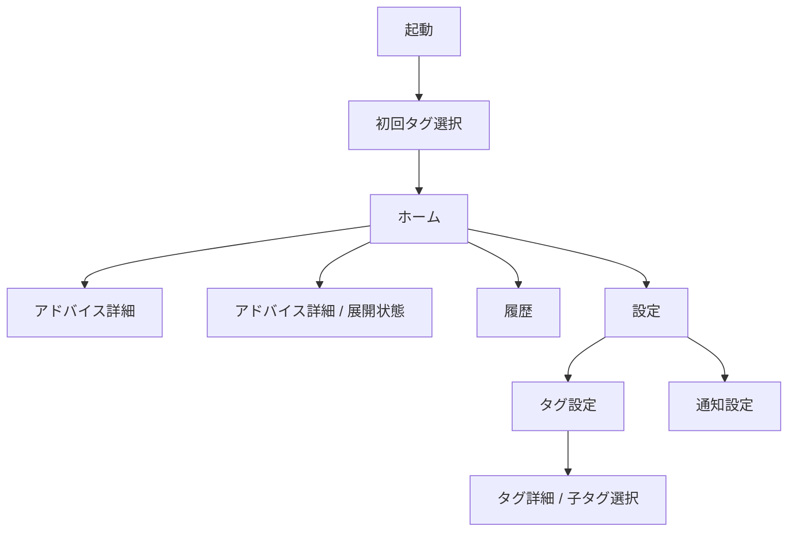
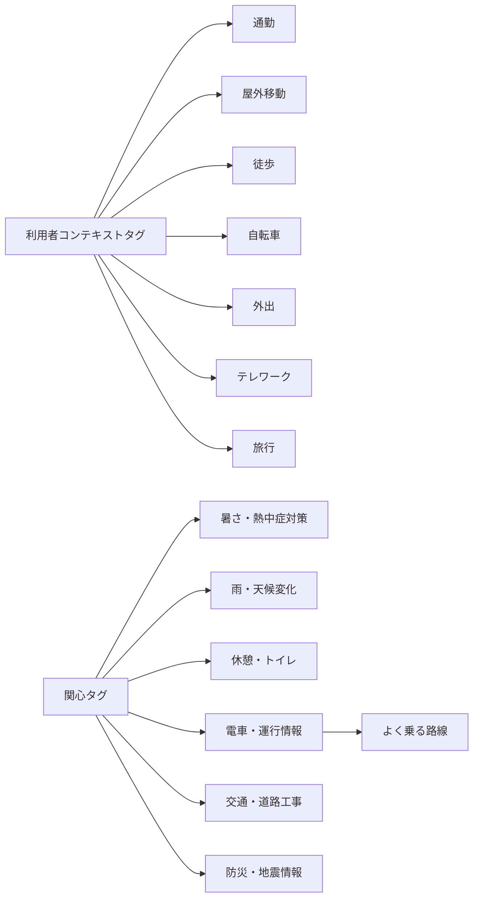

# TOKYO+ ワイヤーフレーム

この文書は [basic_design.md](/Users/yoshidaakinori/projects/tokyo-plus/tokyo-plus-spec/basic_design.md) をもとにした、低忠実度の画面・タグワイヤーフレームである。

前提:
- MVP対象は `今日のアドバイス` を中心とする
- `避難アシスト` は将来機能として扱い、MVPワイヤーには含めない
- タグは固定語彙で、自由入力は行わない
- 画面は「判断を最優先で見せる」構成とする

## 1. 画面構成



## 2. 画面ワイヤー

### 2.1 初回起動・タグ選択

目的:
- 利用者コンテキストタグと関心タグを選ぶ
- 選択内容が通知や判断の前提になることを伝える
- 自由入力を置かず、固定タグだけを選べるようにする

```text
+--------------------------------------------------+
| TOKYO+                                           |
| 都市があなた向けに判断を返します                |
|                                                  |
| 目的                                             |
|  [x] 選んだタグに合う通知を受け取る             |
|  [x] 今日の判断を自分向けにする                 |
|                                                  |
| 利用者コンテキスト                               |
|  [ 通勤 ] [ 屋外移動 ] [ 徒歩 ] [ 自転車 ]       |
|  [ 外出 ] [ テレワーク ] [ 旅行 ]               |
|                                                  |
| 関心                                             |
|  [ 暑さ・熱中症対策 ]                            |
|  [ 雨・天候変化 ]                                |
|  [ 休憩・トイレ ]                                |
|  [ 電車・運行情報 ]  -> 選ぶと路線選択が出る     |
|  [ 交通・道路工事 ]                              |
|  [ 防災・地震情報 ]                              |
|                                                  |
| 選択済み                                         |
|  通勤, 暑さ・熱中症対策                           |
|                                                  |
|  [ スキップ ]                    [ はじめる ]     |
+--------------------------------------------------+
```

補足:
- 1カテゴリ0件でも進められる
- `電車・運行情報` は選択時だけ子タグを開く
- 自由入力や個人属性入力は置かない

### 2.2 ホーム

目的:
- 今日の判断を1件だけ最も目立つように表示する
- 理由と参照データは必要に応じて開ける
- 設定・履歴への導線を持つ

```text
+--------------------------------------------------+
| TOKYO+                       [履歴] [設定]      |
| 今日のアドバイス                                   |
|                                                  |
| +----------------------------------------------+ |
| | 判断タイトル                                  | |
| | 今日は折りたたみ傘を持って出る               | |
| |                                              | |
| | [判断]                                        | |
| | 雨に備えて、外出時は傘を持ってください       | |
| |                                              | |
| | [理由を見る]                                 | |
| +----------------------------------------------+ |
|                                                  |
| 状態                                             |
|  ・最新情報を確認しました                       |
|  ・更新時刻: 08:15                               |
|                                                  |
| 参照データ                                       |
|  [ 天気 ] [ 雨雲 ] [ 工事 ]                      |
|                                                  |
|  [ 詳細を見る ]                                  |
|                                                  |
| 今日は: 通勤 / 屋外移動 / 暑さ・熱中症対策      |
+--------------------------------------------------+
```

表示の意図:
- 最初に見るのは「判断」
- 理由は短く、詳細は折りたたむ
- 参照データはタグ状にして、一覧感を出しすぎない
- `詳細を見る` を押すと、同一画面内でアドバイス詳細がアコーディオン形式で展開される
- 展開時は、判断タイトル、判断、理由、注意点、参照データを下方向に追加表示する
- 再度押すと折りたたみ、ホームの要点表示に戻る
- 詳細は遷移先画面ではなく、ホームからの即時確認を優先する

### 2.3 アドバイス詳細

目的:
- 判断の根拠を開示する
- 参照データ、注意点、生成時刻を確認できるようにする

```text
+--------------------------------------------------+
| < 戻る                 アドバイス詳細            |
|                                                  |
| 判断タイトル                                     |
| 今日は折りたたみ傘を持って出る                  |
|                                                  |
| 判断                                             |
| 雨に備えて、外出時は傘を持ってください          |
|                                                  |
| 理由                                             |
| 午後から雨の可能性があり、外出時の備えが必要です|
|                                                  |
| 注意点                                           |
| ・急な天候変化に注意                             |
| ・交通状況は随時変わる可能性があります          |
|                                                  |
| 参照データ                                       |
| ・気象庁 天気情報                                |
| ・東京都オープンデータ                          |
| ・更新時刻 08:15                                 |
|                                                  |
| [ ホームに戻る ]                                 |
+--------------------------------------------------+
```

補足:
- ホームからのアコーディオン表示と、完全な詳細画面は同じ内容を持つが、表示コンテキストが異なる
- 完全な詳細画面では、折りたたみを前提にせず、最初から判断根拠を見せる
- `詳細を見る` で展開した内容と詳細画面の文言はできるだけ揃える

### 2.3.1 アドバイス詳細 / 展開状態

ホーム上で `詳細を見る` を押したときの展開イメージ:

```text
+--------------------------------------------------+
| TOKYO+                       [履歴] [設定]      |
| 今日のアドバイス                                 |
|                                                  |
| +----------------------------------------------+ |
| | 判断タイトル                                  | |
| | 今日は折りたたみ傘を持って出る               | |
| |                                              | |
| | [判断]                                        | |
| | 雨に備えて、外出時は傘を持ってください       | |
| |                                              | |
| | [詳細を見る]  [閉じる]                        | |
| +----------------------------------------------+ |
| | 理由                                          | |
| | 午後から雨の可能性があり、外出時の備えが必要  | |
| | です                                         | |
| |                                              | |
| | 注意点                                        | |
| | ・急な天候変化に注意                          | |
| | ・交通状況は随時変わる可能性があります       | |
| |                                              | |
| | 参照データ                                    | |
| | ・気象庁 天気情報                             | |
| | ・東京都オープンデータ                       | |
| | ・更新時刻 08:15                              | |
| +----------------------------------------------+ |
|                                                  |
| 今日は: 通勤 / 屋外移動 / 暑さ・熱中症対策      |
+--------------------------------------------------+
```

### 2.4 履歴

目的:
- 過去の判断を一覧で追えるようにする
- その日の判断の変化を振り返れるようにする

```text
+--------------------------------------------------+
| < 戻る                    履歴                  |
|                                                  |
| 2026/08/11                                       |
|  [判断] 傘を持って出る                          |
|  [理由] 午後から雨の可能性                     |
|                                                  |
| 2026/08/10                                       |
|  [判断] 10分早く出発する                        |
|  [理由] 混雑と工事の影響                        |
|                                                  |
| 2026/08/09                                       |
|  [判断] 水筒を持って出る                        |
|  [理由] 暑さ対策                                |
|                                                  |
|  [ 前へ ]                          [ 次へ ]      |
+--------------------------------------------------+
```

### 2.5 設定

目的:
- タグと通知の設定を分けて扱う
- MVPでは最小限の設定項目に絞る

```text
+--------------------------------------------------+
| < 戻る                    設定                  |
|                                                  |
| タグ                                             |
|  [ 利用者コンテキスト ]                          |
|  [ 関心タグ ]                                    |
|  [ 選択済みタグ一覧 ]                            |
|                                                  |
| 通知                                             |
|  [ 通知設定 ]                                    |
|  [ 通知テスト ]                                  |
|                                                  |
| その他                                           |
|  [ 利用規約 ]                                    |
|  [ プライバシーポリシー ]                        |
|                                                  |
|  [ タグ選択をやり直す ]                          |
+--------------------------------------------------+
```

### 2.6 通知設定

目的:
- 朝の通知時刻と頻度を切り替えられるようにする
- 通知キャラクターは将来拡張を見据えつつ、見せ方を整理する

```text
+--------------------------------------------------+
| < 戻る                 通知設定                 |
|                                                  |
| 朝の通知時刻                                    |
|  [ 07:30 ▼ ]                                     |
|                                                  |
| 通知頻度                                         |
|  ( ) うっかりや  1時間間隔 / 1日6件             |
|  (x) わんぱく    3時間間隔 / 1日3件             |
|  ( ) まじめ      6時間間隔 / 1日1件             |
|                                                  |
| 通知キャラクター                                |
|  [ なし ] [ 博士 ] [ おばちゃん ] [ ペンギン ]  |
|                                                  |
|  [ 保存 ]                                        |
+--------------------------------------------------+
```

## 3. タグワイヤー

### 3.1 タグの階層



### 3.2 タグチップの見え方

```text
+--------------------------------------------------+
| タグ                                             |
|                                                  |
| 利用者コンテキスト                               |
| [通勤] [屋外移動] [徒歩] [自転車]               |
| [外出] [テレワーク] [旅行]                      |
|                                                  |
| 関心                                             |
| [暑さ・熱中症対策]                               |
| [雨・天候変化]                                   |
| [休憩・トイレ]                                   |
| [電車・運行情報]                                 |
| [交通・道路工事]                                 |
| [防災・地震情報]                                 |
|                                                  |
| 選択済みタグ                                     |
| 通勤 / 屋外移動 / 雨・天候変化                  |
+--------------------------------------------------+
```

### 3.3 親タグと子タグの表示ルール

- 親タグに子タグが紐づく場合、親タグの選択直後に子タグ選択UIを表示する
- 子タグ選択UIはモーダルまたは子ウィンドウ形式とし、親タグの詳細から分離して見せる
- 子タグ選択UIを閉じても、親タグの選択状態は保持する
- 子タグは親タグの後ろに並べる、または選択済み表示で親タグに紐づく形で保持する
- 子タグ未選択でも親タグは有効とし、補助条件として扱う
- 親タグを外したときは、紐づく子タグも同時に解除する

### 3.4 `電車・運行情報` の子タグ選択

`電車・運行情報` のように子タグを持つ関心タグでは、親タグを選ぶと補助選択のモーダルを表示する。

```text
+--------------------------------------------------+
| 電車・運行情報                           [閉じる] |
|                                                  |
| 説明                                             |
| 遅延・運休などを通知します。選択後、よく乗る路線 |
| を選べます。                                     |
|                                                  |
| よく乗る路線                                     |
| [ JR山手線 ] [ JR中央線 ] [ 東京メトロ丸ノ内線 ] |
| [ 都営浅草線 ] [ 東急田園都市線 ]               |
|                                                  |
| 選択済み                                         |
| [ JR山手線 ]                                     |
|                                                  |
| 0件でも進める                                    |
| [ スキップ ]                      [ 確定する ]    |
+--------------------------------------------------+
```

### 3.5 タグ設定時の補助文言

タグ画面では、各タグに短い説明を添える。

例:
- `通勤` = 定期的な移動の場面
- `屋外移動` = 外を移動する場面
- `電車・運行情報` = 遅延・運休などを通知
- `防災・地震情報` = 公式防災情報の確認
- `よく乗る路線` = `電車・運行情報` に紐づく補助タグ

## 4. 画面の優先順位

MVPで最も重要なのは次の順とする。

1. ホーム
2. 初回タグ選択
3. アドバイス詳細
4. 設定
5. 通知設定
6. 履歴

## 5. ワイヤー上の注意

- 画面はダッシュボード化しない
- 複数候補を並べず、判断1件を中心にする
- 自由入力欄は置かない
- 個人属性を収集しない
- 参照データは細かすぎる一覧ではなく、要約表示にする
- `避難アシスト` の画面は将来機能として別途扱う
