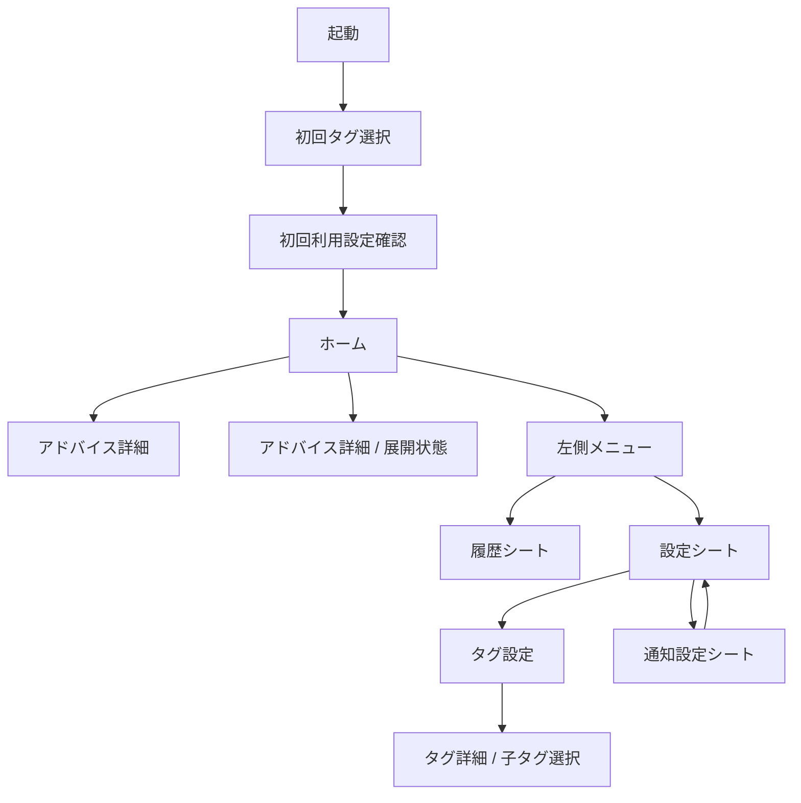
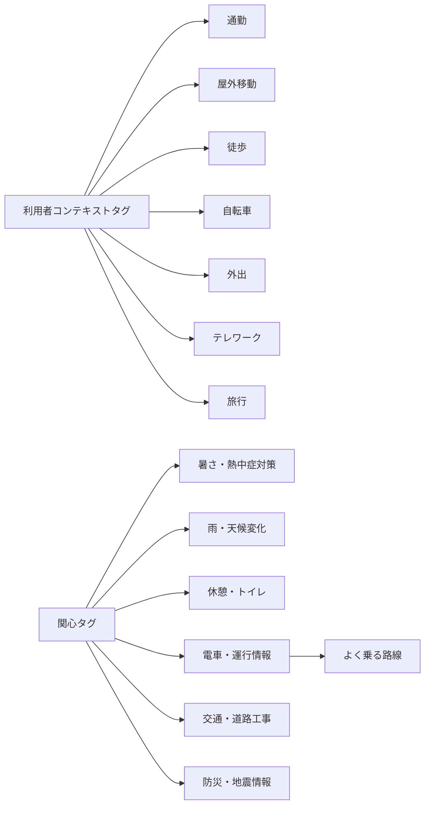

# TOKYO+ ワイヤーフレーム

この文書は [basic_design.md](/Users/yoshidaakinori/projects/tokyo-plus/tokyo-plus-spec/basic_design.md) をもとにした、低忠実度の画面・タグワイヤーフレームである。

前提:
- MVP対象は `今日のアドバイス` を中心とする
- `避難アシスト` は将来機能として扱い、MVPワイヤーには含めない
- タグは固定語彙で、自由入力は行わない
- 画面は「判断を最優先で見せる」構成とする

## 0. 共通レイアウト・コンポーネントルール

- 画面左右の余白は 16px を基準にする
- セクション同士の間隔は 24px を基準にする
- Card の内側余白は 16px を基準にする
- 見出しと内容の間隔は 8px から 12px を基準にする
- Primary Button は高さ 44px を基準にする
- Choice Button は 24px から 28px の高さで、同一目的の選択肢を横並びにする
- Radio Button は、説明が必要な単一選択の設定で使い、行単位で見せる
- InfoButton は、補足が必要だが画面を詰めたくない場合に使う
- Buttonに添える説明文は、Button群の直下に8px前後あけて置く
- 1つの操作目的が同じなら、複数のボタンに分けず、同じコンポーネントにまとめる

## 1. 画面構成



## 2. 画面ワイヤー

### 2.1 初回起動・タグ選択

目的:
- 利用者コンテキストタグと関心タグを選ぶ
- 選択内容が通知や判断の前提になることを伝える
- 自由入力を置かず、固定タグだけを選べるようにする

```text
+--------------------------------------------------+
| TOKYO+                                           |
| 都市があなた向けに判断を返します                |
|                                                  |
| 目的                                             |
|  [x] 選んだタグに合う通知を受け取る             |
|  [x] 今日の判断を自分向けにする                 |
|                                                  |
| 利用者コンテキスト                               |
|  [ 通勤 ] [ 屋外移動 ] [ 徒歩 ] [ 自転車 ]       |
|  [ 外出 ] [ テレワーク ] [ 旅行 ]               |
|                                                  |
| 関心                                             |
|  [ 暑さ・熱中症対策 ]                            |
|  [ 雨・天候変化 ]                                |
|  [ 休憩・トイレ ]                                |
|  [ 電車・運行情報 ]  -> 選ぶと路線選択が出る     |
|  [ 交通・道路工事 ]                              |
|  [ 防災・地震情報 ]                              |
|                                                  |
| 選択済み                                         |
|  通勤, 暑さ・熱中症対策                           |
|                                                  |
|  [ スキップ ]                    [ はじめる ]     |
+--------------------------------------------------+
```

補足:
- 1カテゴリ0件でも進められる
- `電車・運行情報` は選択時だけ子タグを開く
- 自由入力や個人属性入力は置かない

### 2.2 初回利用設定

目的:
- 選択済みタグを確認し、通知設定も同じ画面内で直接行う
- 初回利用時に必要な設定だけを、後からの設定シートと分けて見せる
- タグ設定と通知設定を、それぞれ独立したカードとして見せる
- タグ設定内では、利用者コンテキスト・関心・選択済みを区分して見せる

```text
+--------------------------------------------------+
| [＜ 戻る]                           初回タグ設定 |
| 選んだタグと通知をまとめて設定します。          |
|                                                  |
| +----------------------------------------------+ |
| | タグ設定                                     | |
| | +------------------------------------------+ | |
| | | 利用者コンテキスト                       | | |
| | | 通勤 / 外出 / 徒歩                       | | |
| | +------------------------------------------+ | |
| | +------------------------------------------+ | |
| | | 関心                                     | | |
| | | 雨・天候変化 / 電車・運行情報 ▶ / 防災・地震情報 | |
| | +------------------------------------------+ | |
| | +------------------------------------------+ | |
| | | 選択済み                                 | | |
| | | 通勤 / 電車・運行情報                    | | |
| | +------------------------------------------+ | |
| | あとから変更できます。                       | |
| +----------------------------------------------+ |
|                                                  |
| +----------------------------------------------+ |
| | 通知設定                                     | |
| | 朝の通知時刻  [ 07:00 ▼ ]                    | |
| | あなたの性格は？                             | |
| | [ うっかりや ][ わんぱく ][ まじめ ]         | |
| | 通知の多さを選びます。                       | |
| | 通知キャラクター [ なし ][ 博士 ][ おばちゃん ][ ペンギン ] |
| | ここで初回の通知設定を完了します。            | |
| +----------------------------------------------+ |
|                                                  |
| [ 次へ ]                                         |
+--------------------------------------------------+
```

### 2.3 初回利用設定確認

目的:
- 初回利用時に選んだ内容を確認する
- 保存して開始するとホームへ進む

```text
+--------------------------------------------------+
| [＜ 戻る]                            利用開始確認 |
| 選んだ内容を確認して開始します。                |
|                                                  |
| +----------------------------------------------+ |
| | タグ                                         | |
| | 利用者コンテキスト                            | |
| | 通勤 / 外出 / 徒歩                            | |
| | 関心タグ                                      | |
| | 雨・天候変化 / 電車・運行情報 ▶ / 防災・地震情報 |
| +----------------------------------------------+ |
|                                                  |
| +----------------------------------------------+ |
| | 通知                                         | |
| | 朝の通知時刻  07:00                          | |
| | 通知頻度      わんぱく                       | |
| | 通知キャラクター  なし                       | |
| +----------------------------------------------+ |
|                                                  |
| 設定はあとから変更できます。                    |
|                                                  |
| [ 保存して開始 ]                                 |
+--------------------------------------------------+
```

### 2.4 ホーム

目的:
- 今日の判断を1件だけ最も目立つように表示する
- タイトル、判断、詳細を見る/閉じる、注意点を常時見せる
- 参照データは独立コンポーネントとして切り離し、状態は最下部に置く
- 左上のメニューから履歴・設定へ遷移する

```text
+--------------------------------------------------+
| [☰]                                         |
| 今日のアドバイス                                   |
|                                                  |
| +----------------------------------------------+ |
| | 判断タイトル                                  | |
| | 今日は折りたたみ傘を持って出る               | |
| |                                              | |
| | [判断]                                        | |
| | 雨に備えて、外出時は傘を持ってください       | |
| |                                              | |
| | [詳細を見る]   [閉じる]                      | |
| | -------------------------------------------- | |
| | 注意点                                        | |
| | ・急な天候変化に注意                          | |
| | ・交通状況は随時変わる可能性があります       | |
| +----------------------------------------------+ |
|                                                  |
| 参照データ                                       |
| +----------------------------------------------+ |
| | ・気象庁 天気情報                             | |
| | ・東京都オープンデータ                       | |
| | ・更新時刻 08:15                              | |
| +----------------------------------------------+ |
|                                                  |
| 状態                                             |
|  ・最新情報を確認しました                       |
|  ・更新時刻: 08:15                               |
|                                                  |
+--------------------------------------------------+
```

表示の意図:
- 最初に見るのは「判断」
- タイトル、判断、`詳細を見る` / `閉じる`、divider、注意点は同一コンポーネントとしてまとめる
- 参照データは独立コンポーネントとして切り離す
- 状態は一番下に置く
- 左上のメニューを押すと、画面左からメニューが出る
- `詳細を見る` を押すと、同じコンポーネント内に詳細領域が割り込む
- `閉じる` を押すと、詳細領域を閉じて要点表示に戻る

### 2.5 ホーム内詳細展開

目的:
- `詳細を見る` 押下時に、Home Screen の同一コンポーネントに詳細領域を差し込む
- ここで表示する内容は、判断の根拠、注意点、参照データの詳細部分に相当する

```text
+--------------------------------------------------+
| [☰]                                         |
| 今日のアドバイス                                 |
|                                                  |
| +----------------------------------------------+ |
| | 判断タイトル                                  | |
| | 今日は折りたたみ傘を持って出る               | |
| |                                              | |
| | [判断]                                        | |
| | 雨に備えて、外出時は傘を持ってください       | |
| |                                              | |
| | [詳細を見る]  [閉じる]                        | |
| +----------------------------------------------+ |
| +----------------------------------------------+ |
| | 参照データ                                    | |
| | ・気象庁 天気情報                             | |
| | ・東京都オープンデータ                       | |
| | ・更新時刻 08:15                              | |
| +----------------------------------------------+ |
| | 状態                                          | |
| | ・最新情報を確認しました                      | |
| | ・更新時刻: 08:15                             | |
| +----------------------------------------------+ |
|                                                  |
+--------------------------------------------------+
```

### 2.6 左側メニュー

目的:
- ホームから履歴・設定へ入る入口を1つにまとめる
- 左から出るメニューで下部シートを開く起点を明確にする
- ホームの内容を触ってもドロワーは閉じず、シートだけを切り替える

```text
┌──────────────────────────────────────────────────┐
│ ╳                                                │
│ TOKYO+                                           │
│                                                  │
│ [ 履歴 ]                                         │
│ [ 設定 ]                                         │
│                                                  │
│ 補足                                             │
│ ・背景は暗くしてホームを一時停止する           │
│ ・項目タップで下からシートを表示する           │
│ ・シートを閉じてもドロワーは残る               │
└──────────────────────────────────────────────────┘
```

### 2.7 履歴シート

目的:
- ドロワーの項目をタップしたときに下から表示する
- 右上の `x` や下方向スワイプで閉じる
- 閉じてもドロワーは表示されたままにする

```text
┌──────────────────────────────────────────────────┐
│                              [ x ]               │
│ 履歴                                             │
│ 過去の判断を一覧で追えるようにする。            │
│                                                  │
│ 2026/08/11                                       │
│ 判断: 傘を持って出る                             │
│ 理由: 午後から雨の可能性                         │
│                                                  │
│ 2026/08/10                                       │
│ 判断: 10分早く出発する                           │
│ 理由: 混雑と工事の影響                           │
│                                                  │
│ ︙ 下にスワイプで閉じる                         │
└──────────────────────────────────────────────────┘
```

### 2.8 設定シート

目的:
- タグと通知の設定を分けて扱う
- MVPでは最小限の設定項目に絞る
- `通知設定` は設定シート内の別導線として開く
- 通知設定シートからは `BackButton` で設定シートへ戻る

```text
┌──────────────────────────────────────────────────┐
│                                              [ x ]│
│ 設定                                             │
│                                                  │
│ タグ                                             │
│ [ 利用者コンテキスト ]                           │
│ [ 関心タグ ]                                     │
│ [ 選択済みタグ一覧 ]                             │
│                                                  │
│ 通知                                             │
│ [ 通知設定 ]  ▶                                  │
│ [ 通知テスト ]                                   │
│                                                  │
│ その他                                           │
│ [ 利用規約 ]                                     │
│ [ プライバシーポリシー ]                         │
│                                                  │
│ [ タグ選択をやり直す ]                           │
└──────────────────────────────────────────────────┘
```

### 2.9 通知設定シート

目的:
- 朝の通知時刻と頻度を、説明を添えて切り替えられるようにする
- 通知キャラクターは将来拡張を見据えつつ、見せ方を整理する
- 初回利用設定よりも情報量を増やし、選びやすさより伝わりやすさを優先する
- `BackButton` で設定シートへ戻る

```text
┌──────────────────────────────────────────────────┐
│ [ 戻る ]                                   [ x ]│
│ 通知設定                                         │
│                                                  │
│ 朝の通知時刻                                    │
│ [ 07:30 ▼ ]                                      │
│ 毎朝の最初の通知時刻を決めます。                │
│                                                  │
│ あなたの性格は？                                 │
│ ( ) うっかりや                                   │
│     通知多め / 1時間間隔 / 1日6件                │
│ (x) わんぱく                                     │
│     通知標準 / 3時間間隔 / 1日3件                │
│ ( ) まじめ                                       │
│     通知少なめ / 6時間間隔 / 1日1件              │
│                                                  │
│ 通知キャラクター                                │
│ [ なし ] [ 博士 ] [ おばちゃん ] [ ペンギン ]   │
│ 通知の話し方だけを変えます。判断内容は変わりません。 │
│                                                  │
│ [ 保存 ]                                         │
└──────────────────────────────────────────────────┘
```

## 3. タグワイヤー

### 3.1 タグの階層



### 3.2 タグチップの見え方

```text
+--------------------------------------------------+
| タグ                                             |
|                                                  |
| 利用者コンテキスト                               |
| [通勤] [屋外移動] [徒歩] [自転車]               |
| [外出] [テレワーク] [旅行]                      |
|                                                  |
| 関心                                             |
| [暑さ・熱中症対策]                               |
| [雨・天候変化]                                   |
| [休憩・トイレ]                                   |
| [電車・運行情報]  ▶ 子タグあり                  |
| [交通・道路工事]                                 |
| [防災・地震情報]                                 |
|                                                  |
| 選択済みタグ                                     |
| 通勤 / 屋外移動 / 雨・天候変化                  |
+--------------------------------------------------+
```

### 3.3 親タグと子タグの表示ルール

- 親タグに子タグが紐づく場合、親タグの選択直後に子タグ選択UIを表示する
- 子タグ選択UIはモーダルまたは子ウィンドウ形式とし、親タグの詳細から分離して見せる
- 子タグ選択UIを閉じても、親タグの選択状態は保持する
- 子タグは親タグの後ろに並べる、または選択済み表示で親タグに紐づく形で保持する
- 子タグ未選択でも親タグは有効とし、補助条件として扱う
- 親タグを外したときは、紐づく子タグも同時に解除する
- 親タグは一目で子タグの存在が分かる装飾を付ける。`▶`、バッジ、下線、補助ラベルなどでよい

### 3.4 `電車・運行情報` の子タグ選択

`電車・運行情報` のように子タグを持つ関心タグでは、親タグを選ぶと補助選択のモーダルを表示する。

```text
+--------------------------------------------------+
| 電車・運行情報                           [閉じる] |
|                                                  |
| 説明                                             |
| 遅延・運休などを通知します。選択後、よく乗る路線 |
| を選べます。                                     |
|                                                  |
| よく乗る路線                                     |
| [ JR山手線 ] [ JR中央線 ] [ 東京メトロ丸ノ内線 ] |
| [ 都営浅草線 ] [ 東急田園都市線 ]               |
|                                                  |
| 選択済み                                         |
| [ JR山手線 ]                                     |
|                                                  |
| 0件でも進める                                    |
| [ スキップ ]                      [ 確定する ]    |
+--------------------------------------------------+
```

### 3.5 タグ設定時の補助文言

タグ画面では、各タグに短い説明を添える。

例:
- `通勤` = 定期的な移動の場面
- `屋外移動` = 外を移動する場面
- `電車・運行情報` = 遅延・運休などを通知
- `防災・地震情報` = 公式防災情報の確認
- `よく乗る路線` = `電車・運行情報` に紐づく補助タグ

## 4. 画面の優先順位

MVPで最も重要なのは次の順とする。

1. ホーム
2. 初回タグ選択
3. 初回利用設定
4. 初回通知設定
5. アドバイス詳細
6. 設定
7. 通知設定
8. 履歴

## 5. ワイヤー上の注意

- 画面はダッシュボード化しない
- 複数候補を並べず、判断1件を中心にする
- 自由入力欄は置かない
- 個人属性を収集しない
- 参照データは細かすぎる一覧ではなく、要約表示にする
- `避難アシスト` の画面は将来機能として別途扱う
